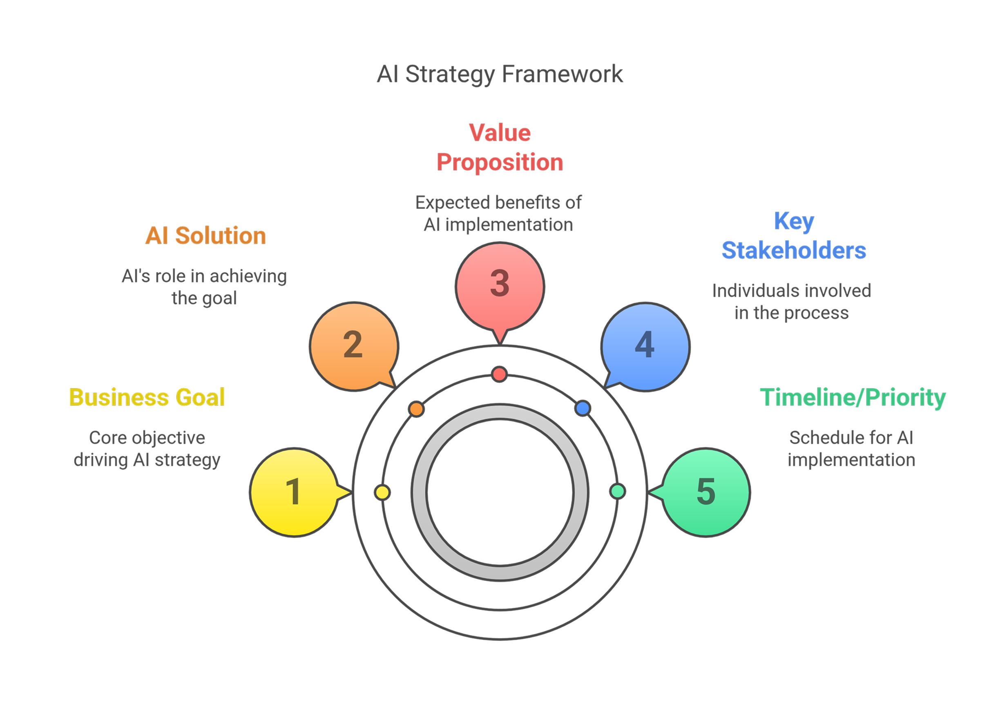
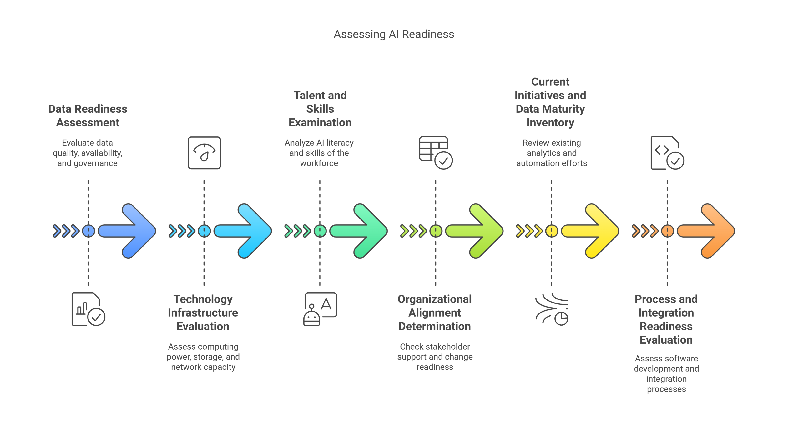
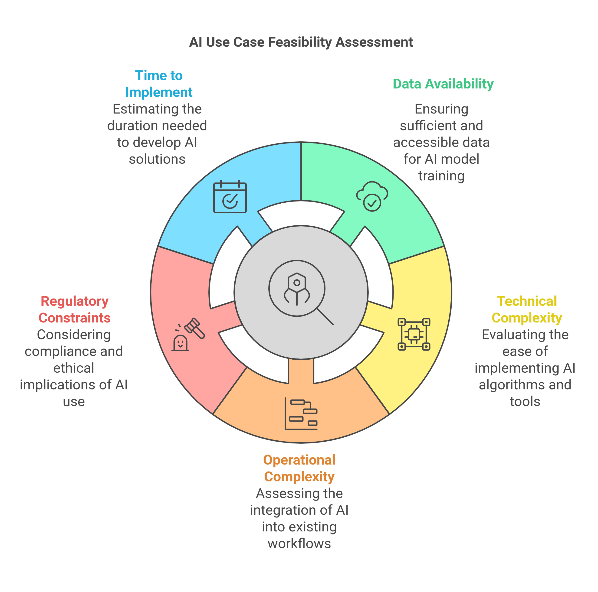
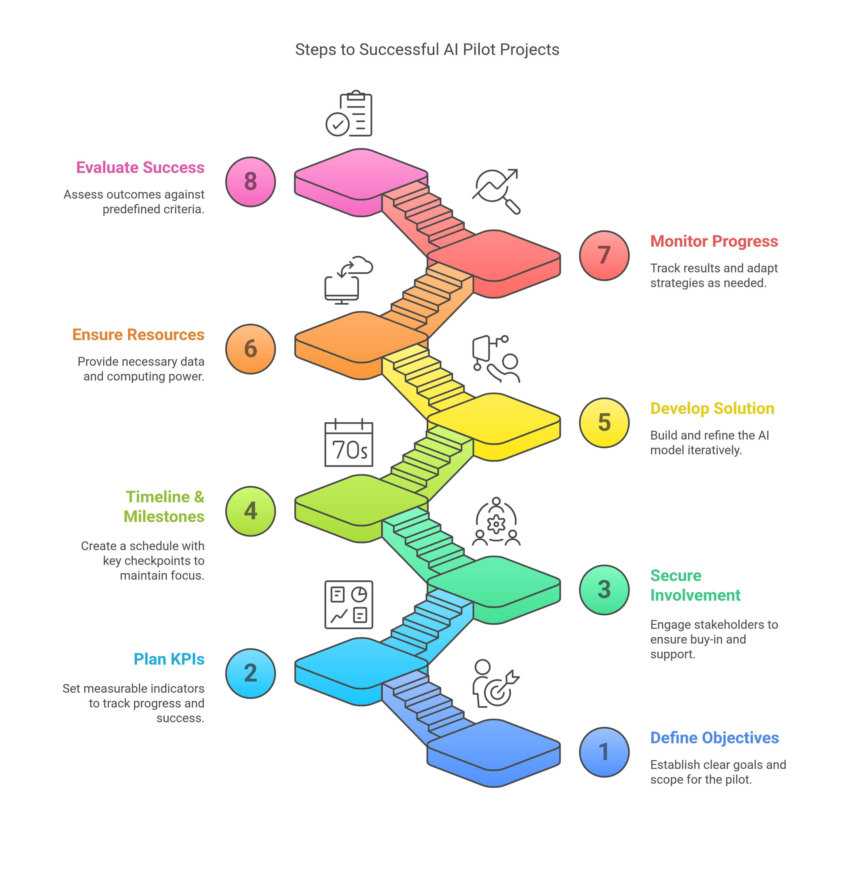
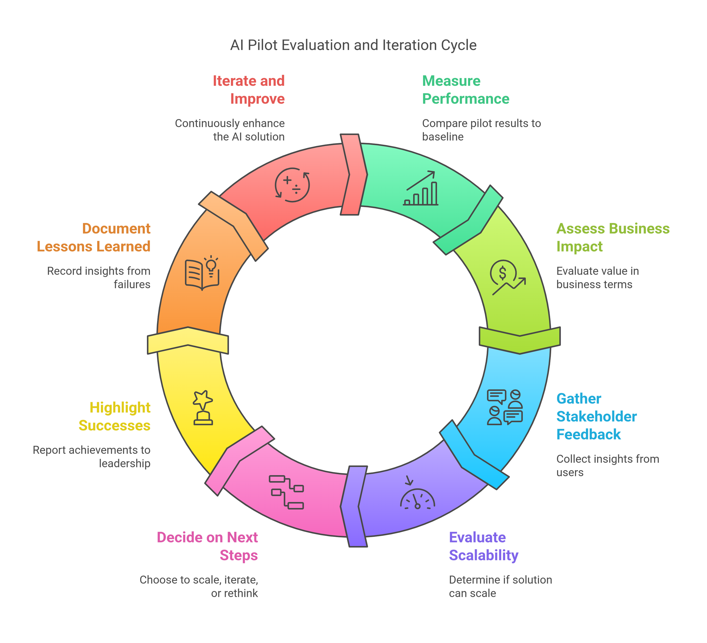
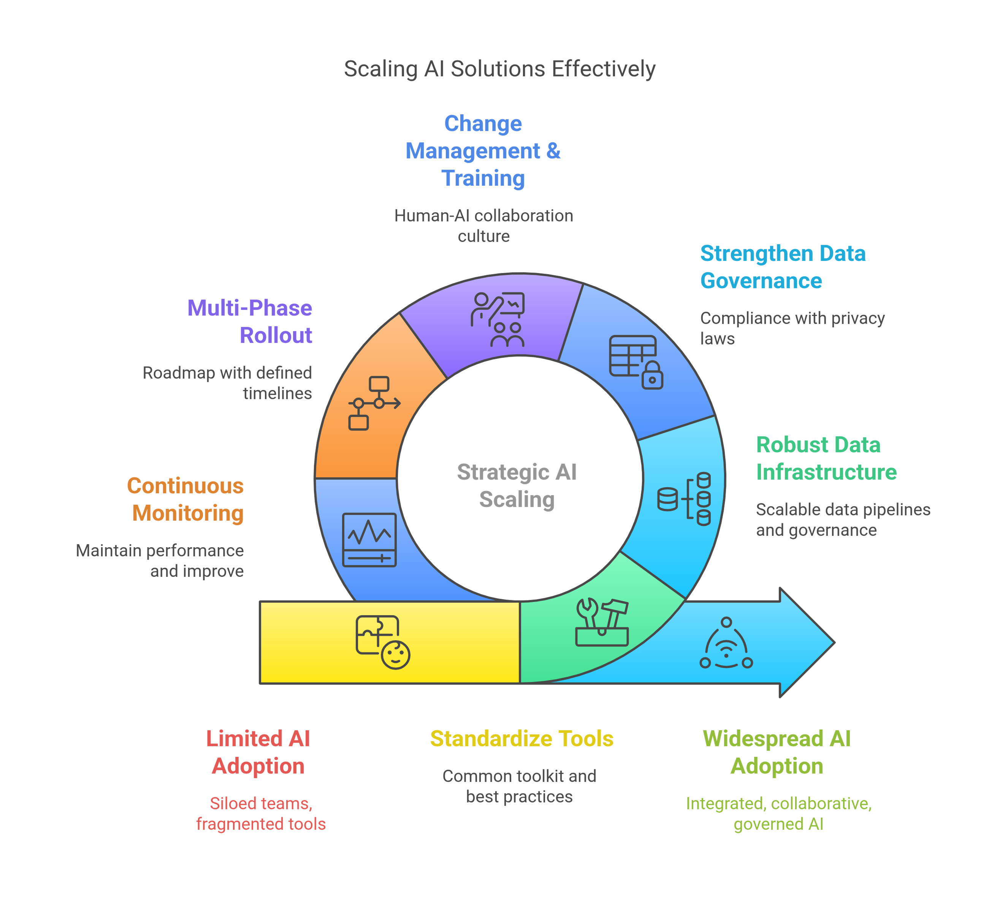
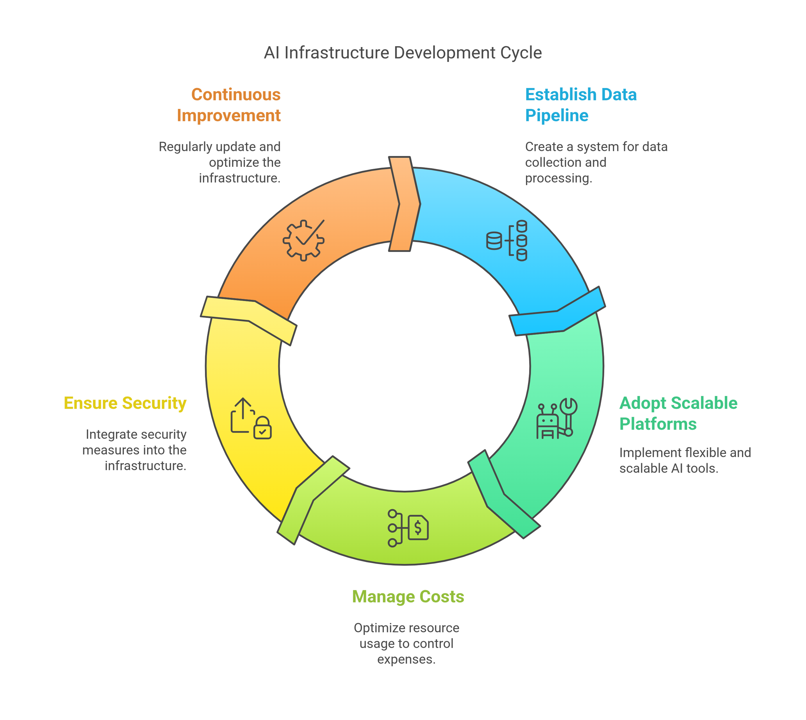
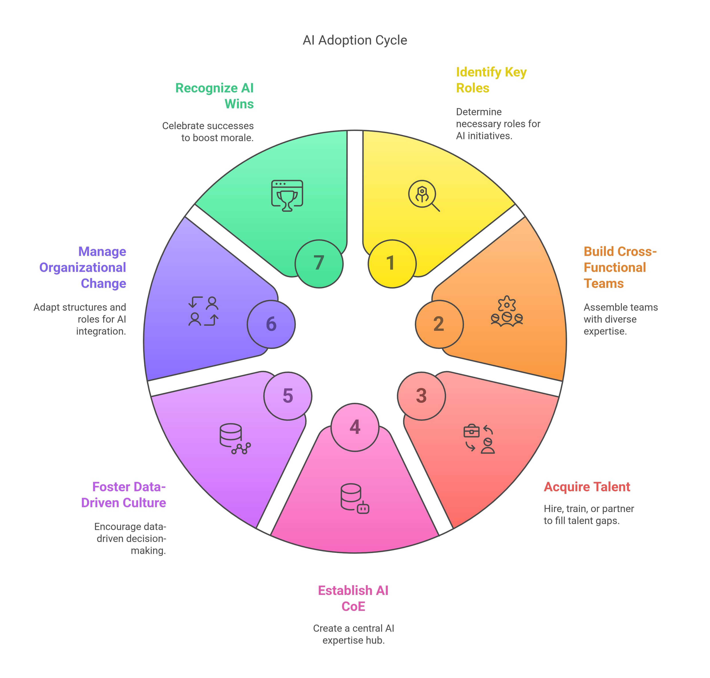
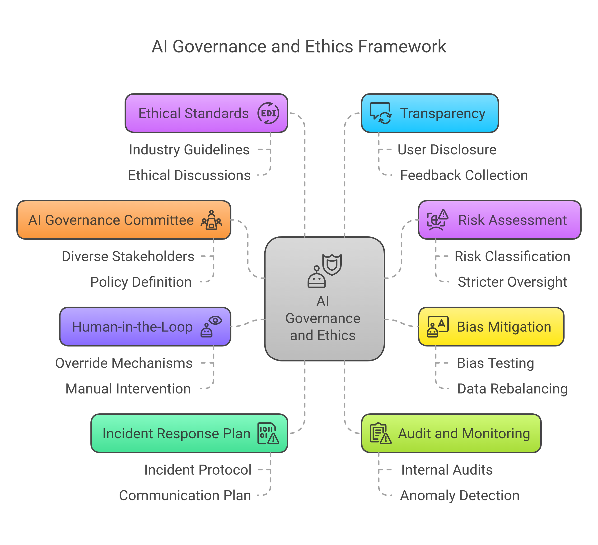
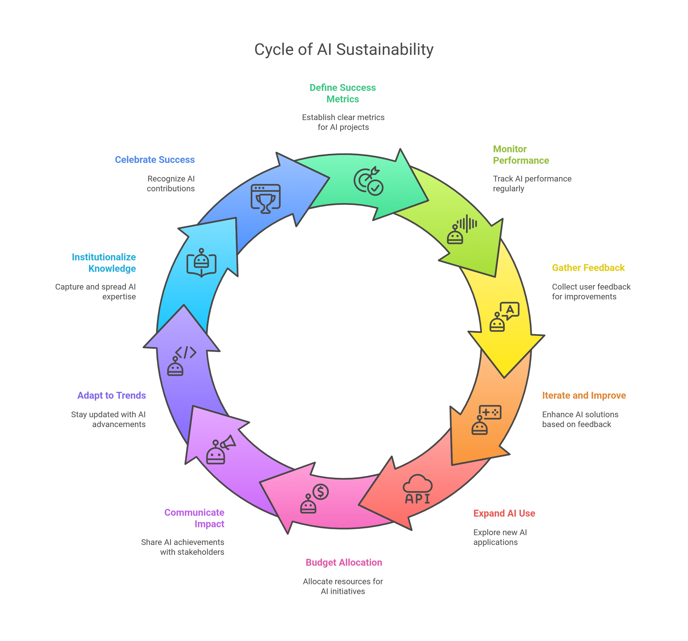

# Leading with AI: Transforming Organizations Through Artificial Intelligence

## By [Luciano Ayres](https://www.linkedin.com/in/lucianoayres/)

### First Edition | Published May 12, 2025

#### Version 1.0

## Introduction

Adopting artificial intelligence at scale has become a strategic imperative for mid-sized and large enterprises. While many organizations experiment with AI in small pilot projects, few manage to translate those experiments into company-wide transformation. In fact, research suggests only around **1%** of companies feel their AI initiatives are truly mature. Without a clear roadmap, even well-intentioned AI projects can stall after the pilot phase – one study found only about **54%** of AI projects ever progress beyond initial pilots. The message is clear: in today's competitive environment, becoming an AI-driven enterprise is no longer optional – it’s quickly becoming table stakes for survival.

This playbook is a **pragmatic guide** for executives and operational leaders to move from isolated AI experiments to an **AI-fueled organization**. We dispense with academic theory and hype, focusing instead on concrete frameworks, decision points, and step-by-step tactics. Each section corresponds to a critical phase of the AI adoption journey – from defining your strategy and selecting use cases, through running effective pilot projects, to scaling and governing AI across the enterprise. Throughout, you’ll find checklists and “playbook” style action plans for quick reference, ensuring that this guide can be put to **immediate practical use**.

Our tone is direct and outcome-oriented. The goal is to enable you to **operationalize AI** in a way that delivers real business value, avoiding common pitfalls and aligning with your organization's objectives and constraints. By following this playbook, your company can confidently progress from tentative pilots to a fully **AI-powered business**, where AI is integrated into core processes, driving efficiency and innovation at scale.

## Overview of the Chapters

This book is structured to guide you through the complete journey of AI adoption in your organization:

* **[Chapter 1: Establishing a Clear AI Strategy and Leadership](#chapter-1-establishing-a-clear-ai-strategy-and-leadership)** – Learn how to craft an AI strategy aligned with business goals, secure executive sponsorship, and establish the leadership structure needed for successful AI initiatives.

* **[Chapter 2: Assessing AI Readiness - Laying the Foundations](#chapter-2-assessing-ai-readiness---laying-the-foundations)** – Evaluate your organization's current capabilities across data, technology infrastructure, talent, and organizational alignment to identify gaps that need addressing before AI implementation.

* **[Chapter 3: Identifying and Prioritizing High-Impact AI Use Cases](#chapter-3-identifying-and-prioritizing-high-impact-ai-use-cases)** – Discover methodologies for selecting AI projects that deliver maximum business value while balancing feasibility and strategic alignment.

* **[Chapter 4: Running Effective AI Pilot Projects](#chapter-4-running-effective-ai-pilot-projects)** – Master the art of designing and implementing AI pilots that validate concepts and build organizational momentum.

* **[Chapter 5: Evaluating Pilot Results and Iterating for Improvement](#chapter-5-evaluating-pilot-results-and-iterating-for-improvement)** – Learn how to assess pilot outcomes, measure performance against objectives, and make data-driven decisions about scaling, iterating, or pivoting.

* **[Chapter 6: Scaling AI Solutions Across the Enterprise](#chapter-6-scaling-ai-solutions-across-the-enterprise)** – Develop strategies for expanding successful pilots into enterprise-wide solutions, including phased rollouts, standardization, and change management.

* **[Chapter 7: Building and Sustaining the AI Infrastructure](#chapter-7-building-and-sustaining-the-ai-infrastructure)** – Establish the data pipelines, technical architecture, and MLOps practices needed to support AI at scale across your organization.

* **[Chapter 8: Organizing Teams and Talent for AI Success (People and Culture)](#chapter-8-organizing-teams-and-talent-for-ai-success)** – Build the human expertise required for AI success through hiring, upskilling, and organizational structures like Centers of Excellence.

* **[Chapter 9: Governance, Risk, and Ethics in AI Adoption](#chapter-9-governance-risk-and-ethics-in-ai-adoption)** – Establish frameworks for responsible AI use, addressing risk management, bias prevention, and regulatory compliance.

* **[Chapter 10: Measuring ROI and Sustaining the AI-Fueled Organization](#chapter-10-measuring-roi-and-sustaining-the-ai-fueled-organization)** – Learn how to track AI success metrics, demonstrate business impact, and create mechanisms to sustain momentum and innovation.

* **[Conclusion: From Pilots to an AI-Fueled Future](#conclusion-from-pilots-to-an-ai-fueled-future)** – A final reflection on the journey and the future of AI in enterprise.

* **[References](#references)**  
  Curated list of studies, articles, and resources cited throughout the book.

Each chapter builds upon the previous one, creating a comprehensive roadmap for transforming your organization through AI. The frameworks, checklists, and action plans provided throughout will help you navigate challenges and accelerate your journey toward becoming an AI-powered enterprise.

---

## About the Author

Luciano Ayres is a seasoned technology leader with over **20 years** of hands-on experience managing teams that develop and deliver **scalable, high-performance solutions** across global platforms. He combines a deep passion for **developer experience** with cutting-edge **AI and automation**, helping engineering teams stay in flow, eliminate toil, and unlock new levels of productivity.

As the author of [_Breaking the AI Productivity Paradox_](https://github.com/lucianoayres/breaking-the-ai-productivity-paradox/blob/main/Breaking_the_AI_Productivity_Paradox_by_Luciano_Ayres.md), [_The AI-First Team_](https://github.com/lucianoayres/the-ai-first-dev-team-book/blob/main/The_AI-First_Dev_Team_Building_AI-Driven_Software_Development_Culture.md) and [_Agentic Software Engineering for Leaders Handbook_](https://github.com/lucianoayres/agentic-software-engineering-for-leaders-handbook/blob/main/Agentic_Software_Engineering_for_Leaders_Handbook.md), Luciano brings real-world insights and practical frameworks to empower people and organizations to thrive in a **digital-first**, AI-augmented world.

Connect with him on [LinkedIn](https://www.linkedin.com/in/lucianoayres).

---

## Chapter 1: Establishing a Clear AI Strategy and Leadership

Successful AI adoption begins with a robust **strategy**. This means articulating how AI will serve your business goals and securing the leadership and structure to drive the initiative. Without strategic alignment and executive support, even the best AI technologies will fail to gain traction. In this chapter, we outline how to craft an AI strategy that is firmly grounded in business priorities and how to set up leadership for success.

* **Align AI with Business Objectives:** Define exactly what you want AI to achieve for your company. Identify the key business challenges or opportunities (e.g. improving operational efficiency, enhancing customer experience, or creating new revenue streams) that AI will address. Every AI project should **directly tie to a business goal** – this ensures it delivers meaningful outcomes and justifies the investment.

* **Secure Executive Sponsorship:** Ensure buy-in from top management. Leadership must not only approve of AI initiatives but champion them. Designate an executive sponsor (or an AI steering committee) responsible for the AI program’s success. This sponsor should communicate the strategic importance of AI adoption throughout the organization and allocate necessary resources. **Leadership commitment** sets the tone and removes roadblocks, empowering teams to pursue AI opportunities confidently.

* **Set a Compelling Vision:** Craft a clear vision of what an “AI-fueled” future looks like for your business. For example: *“Within 3 years, AI will help us reduce supply chain costs by 20%, personalize customer interactions in real-time, and enable data-driven decision-making across all departments.”* A concrete vision guides prioritization and helps rally stakeholders around a common goal. It also helps in communicating to employees *why* the AI transformation is vital.

* **Define Strategic Roadmap:** Develop a high-level **AI roadmap** with short, mid, and long-term phases. This should outline how you will progress from initial pilots to broad adoption. For instance, plan to start with a few pilots in the first 6-12 months, scale successful use cases in 1-2 years, and aim for AI-driven innovation and new business models over 3+ years. (We will detail phased implementation in a later chapter.) Having this roadmap as part of your strategy ensures that everyone understands the journey ahead and their role in it.

* **Integrate with Corporate Strategy:** Treat AI not as a side experiment, but as an integral part of your overall business strategy. Incorporate AI initiatives into annual business plans and OKRs (Objectives and Key Results). This ensures AI projects receive the necessary attention at the highest levels and that their progress is tracked just like other strategic programs. The AI strategy should complement and enhance other strategic initiatives (for example, digital transformation or customer-centricity efforts). **In short, AI is a means to an end – support the company’s broader mission.**

* **Establish Governance Early:** As part of the strategy, decide how AI decisions will be made and overseen. Identify who will evaluate and approve AI project proposals, manage ethical considerations (more on that later), and coordinate cross-department efforts. Many enterprises set up an **AI Council** or assign a Chief AI Officer/Center of Excellence at this stage to ensure a coordinated approach. This governance structure is seeded in the strategy phase so that as projects multiply, there is clarity on ownership and decision rights.

* **Prioritize High-Impact Opportunities:** A strategic view also means deciding where to focus AI efforts for the greatest reward. Rather than attempting AI everywhere at once, pinpoint the areas with the highest potential business value and strategic alignment. We’ll discuss use-case selection in the next chapter, but keep the strategic big picture in mind: choose battles that matter. Early successes in these areas will build momentum for broader AI adoption.

**Framework: Linking AI Strategy to Business Goals**
A quick framework to ensure your AI strategy is business-driven:

* *Business Goal:* Identify a top-level business goal (e.g. “reduce customer churn”).

* *AI Solution:* Determine how AI can contribute (e.g. predictive analytics model to identify at-risk customers and suggest retention actions).

* *Value Proposition:* State the expected benefit (e.g. “decrease churn by 5%, equating to \$X million retained revenue”).

* *Key Stakeholders:* List who needs to be involved or informed (e.g. VP of Marketing, Customer Success Team, Data Science Lead).

* *Timeline/Priority:* Decide when to pursue this (e.g. pilot in Q1, full rollout by Q3 if pilot succeeds).

By filling out the above for each major AI initiative, you create a clear line of sight from AI work to business outcomes. This helps justify projects and coordinate efforts across leadership.

**Action Checklist – AI Strategy and Leadership**:

* [ ] **Executive Champion Identified:** Who at the C-level is accountable for AI success?
* [ ] **AI Vision Statement:** A concise description of what AI will do for our business in 1-3 years.
* [ ] **Strategic Alignment Documented:** Mapping of AI initiatives to specific business objectives.
* [ ] **AI Roadmap Drafted:** Phased plan (pilot phase, expansion phase, scaling phase) with timeframes.
* [ ] **Governance Setup:** Defined committee or roles for AI oversight, including ethics and risk management.
* [ ] **Communication Plan:** Plan for how leadership will communicate the AI strategy and vision to all employees (to set context and manage expectations).

By establishing a solid strategy and leadership foundation, you create organizational clarity and commitment. This foundation is critical – it ensures that subsequent steps (like choosing projects, investing in technology, and scaling pilots) all ladder up to a cohesive vision. In the next chapters, we’ll build on this strategy to assess readiness and execute effectively.

---

## Chapter 2: Assessing AI Readiness - Laying the Foundations

Before plunging into AI projects, it’s essential to **assess your organization’s readiness** to implement and support AI. Mid-to-large enterprises often have complex systems, siloed data, and varying skill levels across teams. A frank readiness assessment will illuminate gaps that need to be addressed (or mitigated) to ensure AI initiatives can succeed. Skipping this step can lead to frustrating pilot failures or stalled deployments down the line. In this chapter, we examine how to evaluate your data, technology, and people capabilities for AI, and what to do with the findings.

Begin by evaluating your company across several key dimensions of AI readiness:

### Checklist: Assessing AI Readiness

* **Data Readiness:** Do you have the data needed to fuel AI? Assess the **quality, availability, and governance** of your data. Are your datasets reliable (accurate, up-to-date, and sufficiently large)? Are they accessible in a way that data scientists and AI systems can use (minimal silos, well-documented)? Strong data management practices – including data cleaning, integration across sources, and clear data ownership – are foundational. *If data is the new oil, is your company sitting on a refined fuel or crude stockpile?* If data quality or access is lacking, plan initiatives to improve data governance and build the necessary data pipelines.

* **Technology Infrastructure:** Evaluate whether your current IT infrastructure can support AI workloads. This includes computing power (CPU/GPU resources), storage, network capacity, and cloud capabilities. Can your systems handle the training of machine learning models, which may require significant processing power? Are you equipped to deploy AI models in production (for example, do you have servers or cloud instances for running models 24/7)? Also, review software/tooling: do you already have analytics or ML platforms in-house, and are they sufficient for your plans? Identifying gaps here (perhaps needing a cloud platform, specific AI frameworks, or MLOps tools) will inform your technology investment strategy.

* **Talent and Skills:** Examine the **AI literacy and skills** of your workforce. Do you have data scientists, machine learning engineers, or other AI specialists on staff? If not, do current teams have some analytical or technical expertise that can be upskilled? Just as importantly, assess the general understanding of AI among business and IT teams: is there a baseline familiarity with data-driven decision making, or will you need to start with educational initiatives? Identify skill gaps (e.g., lack of expertise in data engineering, model development, or analytics translation) and note which can be filled by training versus hiring or partnering. A knowledgeable workforce is required to leverage infrastructure and data for AI’s full potential.

* **Organizational Alignment:** Determine if your organization’s structure and culture are prepared for AI. Are *key stakeholders* (business unit heads, IT leaders, etc.) aware of and supportive of the AI strategy? Is there a willingness to collaborate across departments (since AI projects often cut across traditional silos)? Also, assess change readiness – how have past tech transformations fared in your company? An organization that is agile, with good cross-functional teamwork and an openness to innovation, will more easily embrace AI. On the flip side, if you foresee resistance or bureaucratic hurdles, those need addressing (through change management strategies we discuss in a later chapter).

* **Current Initiatives and Data Maturity:** Take inventory of any existing analytics or automation efforts. A company with a mature business intelligence practice or basic automation in place may be more ready to evolve those into AI capabilities. There’s a continuum from basic data analytics to advanced AI – know where you currently stand. For example, if your enterprise already analyzes historical data for insights, the next step might be predictive modeling with AI. If you have not yet centralized your data (e.g., still running on separate departmental databases), that is a prerequisite task before advanced AI. Understanding this maturity level helps set realistic starting points.

* **Process and Integration Readiness:** Evaluate if you have processes in place for software development and integration that can extend to AI. Implementing AI isn’t just about building models; it’s about embedding those models into business processes or customer-facing applications. Do you have an API strategy or middleware that allows new AI services to plug into existing systems? Are there DevOps/MLOps practices established for deploying and updating software regularly? If not, you may need to implement new processes for deploying AI (we’ll cover MLOps in a later chapter). Also, consider data security and privacy processes – adopting AI may mean handling sensitive data in new ways, so existing security protocols must be up to scratch.

Performing this **AI readiness assessment** will likely reveal areas that need improvement or preparation. Treat these not as roadblocks but as a to-do list to prepare your foundation. For instance, if data is a weakness, invest early in data integration and cleaning efforts. If skills are lacking, plan for hiring or training programs. Many organizations find that doing a small **proof-of-concept** AI exercise can itself be an effective diagnostic: it exposes practical shortcomings in data or tech that theoretical assessments might miss. We will discuss pilot projects in the next chapter – consider your first pilot partly as a *readiness test* of your organization.

**Action Checklist – AI Readiness**:

* [ ] **Data Audit Completed:** Key datasets inventoried and evaluated for quality, gaps identified (e.g., need to collect additional data or fix quality issues).
* [ ] **Tech Infrastructure Review:** Systems audited for AI capability (compute, storage, tools). Decision made on whether to use cloud resources, invest in new hardware, or leverage existing infrastructure for initial projects.
* [ ] **Skills Assessment:** Current team’s skills mapped; list of needed roles or skills to acquire (hire, contract, or train) prepared.
* [ ] **Training Plan:** If upskilling is needed, initial training or workshops on AI basics scheduled for staff to build baseline knowledge.
* [ ] **Cultural/Structural Gaps Identified:** Any potential resistance or misalignment noted. Plan formulated to address these (e.g., align incentives, get early buy-in from hesitant departments).
* [ ] **Security & Compliance Check:** Preliminary check that adopting AI (especially using certain data) will meet regulatory/privacy requirements. Engage your security/compliance team early so they are part of the readiness evaluation.
* [ ] **Baseline Metrics:** Establish baseline metrics (current performance levels) for areas AI is expected to improve. This will help later in evaluating AI impact.

Taking the time to **prepare the soil** before planting AI projects pays off. It reduces the chance of pilot failure due to preventable issues (like missing data or insufficient server capacity) and creates a shared understanding across the company of what’s needed. Once you have a clear picture of your readiness, you can proceed to selecting the right projects that fit your starting point and strategic goals.

---

## Chapter 3: Identifying and Prioritizing High-Impact AI Use Cases

With a strategy in place and an understanding of your readiness, the next step is choosing **where to apply AI**. Not every problem is suitable for AI, and not every AI project will deliver the value you seek. Especially in mid-to-large organizations, there could be dozens of potential AI ideas – from automating routine tasks to optimizing complex decisions. This chapter focuses on how to identify, evaluate, and prioritize AI use cases that align with your strategy and have a high likelihood of success.

**Start with Business Pain Points:** Begin by listing the significant challenges or inefficiencies in your business that, if solved, would yield substantial benefits. Engage different departments to gather input – for example, customer service might struggle with long response times, operations might have costly manual processes, marketing might need better personalization, etc. Prioritize problems where smarter automation or data-driven prediction could make a real difference. By focusing on pain points, you ensure the AI use case has a clear purpose (solving a real business need) rather than being a solution in search of a problem.

**Consider Strategic Alignment and Value:** From the list of problems/opportunities, evaluate each for its alignment with the strategic goals defined in Chapter 1. A use case directly tied to strategic priorities (say, improving customer retention or reducing operational cost) should rank higher. Next, estimate the **potential value**: What is the upside if AI succeeds here? This could be quantified (e.g. saving 10,000 man-hours/year, increasing sales by 5%) or qualitative (e.g. improving customer satisfaction, enabling better decision-making). This exercise ensures you target use cases with meaningful impact, not just trivial automation.

**Assess Feasibility:** Hand-in-hand with value is **feasibility** – how practical is it to implement AI for this use case given current capabilities and constraints? Consider:

* **Data availability:** Do we have the data needed to support this use case (and is it accessible as identified in readiness check)? If you lack data to train an AI model for a particular problem, that use case might be less feasible right now.

* **Technical complexity:** Some AI applications (like straightforward prediction or classification tasks) are easier, while others (like complex computer vision or NLP tasks) may be harder or require specialized expertise. Evaluate whether the needed algorithms and tools are within reach.

* **Operational complexity:** How hard will it be to integrate the AI solution into existing workflows? A use case that requires changing many downstream processes or retraining hundreds of staff might be less feasible than one more contained in scope.

* **Regulatory or Ethical constraints:** If a potential AI application touches sensitive areas (e.g., deciding on loan approvals, medical diagnoses, etc.), consider the compliance and ethical implications. Such use cases may need extra scrutiny or might be better left until governance frameworks are firmly in place.

* **Time to implement:** Estimate the time needed to develop a solution. Quick wins (projects that can show results in a few months) are valuable for momentum, whereas anything that looks like it will take years might be too ambitious as a starting point.

**Aim for High-Impact, Low-Risk Pilots:** Especially for your **initial AI projects**, a good strategy is to pick use cases that offer a **high potential impact** but carry a relatively **low risk of failure**. Low risk in this context means projects that are not mission-critical (failure won’t be catastrophic to operations), have manageable scope, and involve technologies you understand. This allows your team to learn and score a “win” without betting the farm. For example, automating a manual data entry process or implementing a customer service chatbot are often safer starting bets than, say, completely revamping a core production line with AI robotics on day one. The idea is to *start small but think big* – you start with a contained project that can demonstrate value and teach lessons, setting the stage to scale up.

**Framework: Selecting AI Use Cases (Impact vs. Feasibility Matrix)**
A useful tool for prioritization is to map potential use cases on a two-axis matrix:

* **X-axis:** Feasibility (low to high)
* **Y-axis:** Impact (low to high)

Plot each candidate use case. Naturally, the **upper right quadrant (high impact, high feasibility)** contains the gold mine – those should be top priorities. **High impact but lower feasibility** may be medium-term bets (perhaps requiring initial groundwork or waiting for more data). **High feasibility but lower impact** could be quick wins or learning exercises – consider doing a couple to build confidence, but be cautious not to invest too much in low-value projects at the expense of more important ones. **Low-low (low impact, low feasibility)** should be dropped or reconsidered; they are not worth pursuing.

This matrix approach forces a comparative view, helping stakeholders agree on what *really matters now* versus later. It also helps in justifying to leadership why you are focusing on certain projects first.

**Document the Use Case Requirements:** Once a use case is chosen (or at least a short list of top candidates), spend time to clearly define it. This can prevent misalignment down the road. For each use case, create a one-page brief covering:

* **Problem Statement:** What exact problem will this AI solution solve? (e.g., “Reduce the time to resolve customer support tickets by predicting and routing issues to the right team automatically.”).

* **Success Metrics:** How will we measure success? (e.g., “Average ticket resolution time should drop by...5%” or “First-call resolution rate should increase to 90%”). Include baseline numbers if available, so you have a point of comparison post-AI implementation.

* **Data Requirements:** What data will the AI need? List the data sources and types (e.g., customer transaction records from CRM, sensor data from machines, etc.) and note any gaps to fill. Ensure you have access to this data and permission to use it. If data needs to be collected or aggregated, mark that as a prerequisite task.

* **Approach Outline:** Describe in simple terms the AI approach or technique anticipated. For instance, “Use a machine learning model (classification) to predict X” or “Use NLP to analyze customer feedback”. This isn’t a detailed technical spec, but it forces clarity on what kind of AI solution is envisioned (prediction, optimization, computer vision, etc.). Also note any specific tools or algorithms if known (e.g., “train a random forest model” or “deploy a pre-built AI service for image recognition”).

* **Integration & Infrastructure Needs:** Identify how and where this AI solution will be deployed in the business process. For example, “the model will be integrated into the customer support ticketing system” or “AI outputs will be delivered via a dashboard to managers”. Note any infrastructure requirements (runtime environment, APIs, cloud services) needed to support this. This ensures early consideration of how the AI will actually be used operationally, not in a vacuum.

* **Stakeholders & Team:** Who will be involved in implementing and using this AI solution? Identify the business owner (e.g., Head of Customer Support for a support AI), the development team (data scientists, IT, etc.), and end users (employees or customers interfacing with the AI). Stakeholder clarity ensures everyone knows their role and who to coordinate with. It also helps later when evaluating the pilot – the stakeholders identified here should be providing feedback and assessing success.

* **Potential Risks or Constraints:** (Optional but wise) Note any obvious risks – for example, “ensure model decisions are unbiased regarding demographic groups” or “data is sensitive, must comply with privacy policies”. Calling these out early means you can account for them in project planning or decide if a use case is too risky for now.

Documenting these elements for each top use case creates a **mini project charter**. It will clarify assumptions and requirements for decision-makers. Often, going through this exercise might cause some use cases to be reconsidered (you might find one needs data you don’t have, or success metrics aren’t compelling enough). That’s a good outcome – better to refine or drop a weak idea on paper than after investing time and money.

After prioritizing, you should have a **short list of high-priority AI projects**. It’s usually best to start with **one to three pilot use cases** initially, depending on your resources. Starting with too many at once can stretch your talent thin and complicate learning. Choose a focused set of projects that together cover your strategic objectives and vary in scope (for example, one customer-facing AI pilot and one internal process pilot). In the next chapter, we dive into how to execute these pilot projects successfully, setting the stage for broader AI adoption.

---

## Chapter 4: Running Effective AI Pilot Projects

Selecting the right pilot is critical, but execution is where the rubber meets the road. **AI pilot projects** are the experimental trials where you implement a solution on a limited scale to validate its feasibility and value. The goal of a pilot is to learn and demonstrate outcomes, not to achieve perfection or full scale deployment. This chapter provides a playbook for planning and managing AI pilots to maximize learning and ROI, while minimizing disruption and risk.

**Define Clear Objectives and Scope:** Every pilot needs well-defined objectives. What specific outcomes do you expect from this pilot? For example: *“Automate invoice processing to reduce manual effort by 50% within the finance department.”* **Narrow the scope** of the pilot to keep it manageable. This might mean limiting it to a particular department, dataset, or customer segment. A tightly scoped pilot is easier to control and less likely to run into overwhelming complexity. Clear objectives (tied to success metrics identified earlier) will guide the pilot team and provide criteria for evaluation.

**Plan Measurable KPIs:** Along with objectives, establish the **key performance indicators (KPIs)** that will be measured during the pilot. These should include the business metrics you ultimately care about (e.g., time saved, error rate reduction, sales uplift in the pilot group) and technical metrics of the AI system (e.g., model accuracy, prediction latency). Setting target ranges for these KPIs (or at least expected direction of change) is important to later determine if the pilot is a success. Make sure you also capture a **baseline** for these KPIs before the AI is introduced, so you can make a before/after comparison.

**Secure Stakeholder Involvement:** Assemble a **cross-functional pilot team** that includes all relevant stakeholders. Typically this means: domain experts or business users from the affected department, data scientists or developers building the AI, IT staff to integrate systems, and a project manager or product owner to coordinate. Engage end-users who will interact with the AI early – their input can shape the pilot to be more user-friendly and they become change agents who support the project. Importantly, keep leadership in the loop (the executive sponsor from Chapter 1 or their delegates) with regular updates. Their support may be needed if issues arise that require extra resources or change in approach.

**Timeline and Milestones:** Construct a timeline for the pilot (e.g., a 3 to 6 month pilot period, depending on complexity) and mark key milestones. Milestones could include: data ready by date X, model prototype by Y, intermediate evaluation, user testing, pilot completion, etc. A defined timeline prevents pilot projects from meandering endlessly (a common failure mode is the “pilot that never ends”). It also creates urgency and expectations for the team. Many successful AI pilots are executed in roughly 6 months or less; longer than that and momentum can be lost or business conditions change. Time-box the pilot with the understanding that at the end, a “go/no-go” decision will be made to scale or not.

**Develop the Pilot Solution:** This is where the data scientists and engineers build the model or AI system. During development, **keep business goals front and center** – it’s easy for technical teams to get deep into tweaking algorithms and lose sight of the end-use. Regularly check back to the problem statement and success metrics. Use an **iterative approach**: develop a minimum viable model or prototype quickly, test it on real data, and refine. Share early versions with select end-users if possible to gather feedback (e.g., if you built a chatbot, let a few support reps try it on sample queries). This agile methodology ensures the solution is on the right track and adapts to insights gained along the way.

**Ensure Sufficient Data and Resources:** During the pilot, make sure the team has access to the data and computing resources they need. Data issues often surface as you begin building – maybe data needs further cleaning or additional sources are required. Allocate time in the pilot for data preparation (often 60-70% of effort in AI projects is data wrangling). On the infrastructure side, use cloud resources or scalable environments for experimentation if possible, so that computing power is not a bottleneck. If the pilot is computationally heavy, ensure budget for cloud compute or appropriate hardware is accounted for in the pilot plan.

**Monitor Progress & Adapt:** Treat the pilot as an experiment with a hypothesis (“If we apply AI to X process, we will achieve Y improvement”). As it runs, monitor interim results. Are early tests of the model showing improvement against baseline? If something’s not working (say model accuracy is far below requirement), investigate and iterate – perhaps the model needs a different feature or more training data. It’s better to catch and fix issues *during* the pilot than to gloss over them until the end. Hold brief **check-in meetings weekly or bi-weekly** with the pilot team to track progress, discuss obstacles, and adjust plan if needed. However, be cautious about scope creep: avoid letting the pilot expand its goals mid-stream (“while we’re at it, let’s also solve this other problem...”) unless absolutely necessary. Keep focus on the defined objectives.

**Pilot Success Criteria:** Before concluding the pilot, have a predefined checklist for what constitutes success vs. failure vs. something in-between. For example: *Success = achieved at least 80% of target KPI improvement and users are satisfied; Failure = model could not meet minimum performance or process showed no improvement.* There might be a gray zone where results are promising but not as high as hoped – in such cases, you might consider extending the pilot or iterating further. The important part is to *decide in advance* how you will judge the outcomes, to avoid bias in evaluation later. It also sets the stage for making a clear recommendation post-pilot (scale or not).

**Common Pitfalls in AI Pilots (and How to Avoid Them):**

* *Unrealistic Expectations:* Don’t assume the AI will be a magic wand that instantly solves problems on its own. AI models require training, tuning, and occasionally significant rework. Manage expectations by educating stakeholders that the pilot is a learning process and results may be incremental. Celebrate progress, but also communicate limitations honestly.

* *Poor Data Quality:* A pilot built on bad data is doomed from the start. If the pilot uncovers data quality issues (and it often will), address them immediately – even if that means pausing to cleanse data or adjust the dataset. It’s better to have a smaller clean dataset than a large dirty one. Prioritize data quality over fancy algorithms; a simple model on good data beats a complex model on garbage data.

* *Lack of User Buy-In:* If the people who are supposed to use or be affected by the AI aren’t on board, the pilot can fail due to social, not technical, reasons. Avoid developing the pilot in isolation. Involve end users and subject matter experts throughout, train them on the new tools, and incorporate their feedback. This not only improves the solution but also builds advocates who will champion the AI if it moves to full deployment.

* *Overcomplicating the Pilot:* It’s a pilot – keep it as simple as possible to test the concept. Don’t try to build a perfect, fully featured system. Many pilots fail because teams over-engineer them or try to solve edge cases that could be handled later. Focus on the core functionality that delivers value. If the pilot proves that core idea works, you can flesh out details in the scaling phase.

* *Insufficient Monitoring:* Sometimes teams “fire and forget” an AI pilot, only to realize at the end that it underperformed. Treat the pilot like a scientific experiment – monitor interim results (e.g., track the KPIs periodically, not just at the end). This way, you can course-correct. Also, watch for unexpected side effects; maybe the AI improved one metric but hurt another (e.g., a model that speeds up processing might lower quality in some cases). Early detection allows mitigation.

By being mindful of these pitfalls and proactively addressing them, you greatly increase the chances that your AI pilot will yield useful insights or positive results.

**Finalize Pilot and Document Results:** When the pilot period ends, gather the data and analyze the outcomes rigorously. Document the performance against each success metric, any qualitative feedback from users, and lessons learned (technical, operational, organizational). This documentation will be golden for making the case to executives about what to do next, and for guiding future AI projects. If the pilot had mixed results, detail what factors led to shortfalls – was it model accuracy, data issues, user adoption, etc. Sometimes a pilot that “failed” still provides invaluable knowledge that will make the next attempt successful.

With a completed pilot (or pilots), you are now at a decision point: is the AI solution ready to scale up, does it need refinement, or should it be shelved? In the next chapter, we cover how to evaluate pilot outcomes and turn successful experiments into enterprise-scale deployments.

---

## Chapter 5: Evaluating Pilot Results and Iterating for Improvement

An AI pilot’s true value comes from the **learning and evidence** it produces. Now it’s time to answer: Did the pilot achieve the desired outcomes, and what should we do next? In this chapter, we’ll lay out a structured approach to evaluate your pilot results and decide on the path forward. Whether the pilot succeeded or fell short, there are clear next steps – scale up, iterate, or rethink – based on data-driven insights.

**Measure Performance vs. Baseline:** Start by comparing the pilot’s results to the original baseline and objectives. Look at the KPIs you defined: How did the AI solution perform relative to the status quo? For example, if your baseline customer churn was 10% and the pilot AI predicted and helped reduce it to 8%, that’s a measurable improvement. Key evaluation criteria include **efficiency gains, accuracy improvements, or other target metrics vs. their pre-AI levels**. If possible, use a control group or historical trend as a reference to ensure the improvement isn’t due to other factors. Statistical analysis can help determine if changes are significant. The goal is to quantify the AI’s impact: *did it do better than how the process was done before?*

**Assess Business Impact:** Beyond raw performance metrics, translate the results into **business impact**. Did the AI pilot deliver value in business terms? For instance, “processing time per document dropped from 5 minutes to 2 minutes, saving an estimated 100 hours of manual work per week,” or “the recommendation model increased average order value by \$5, translating to \$500K extra revenue per quarter.” Also consider qualitative impact: are customers happier (maybe CSAT scores went up)? Are employees finding it easier to do their job? This ties the pilot outcomes back to the language of executives (cost, revenue, quality, satisfaction) – crucial for securing approval to scale. If an AI pilot didn’t move the needle on business metrics, that’s a red flag that either the use case wasn’t right or the implementation needs changes.

**Gather Stakeholder Feedback:** Numbers alone don’t tell the whole story. **Solicit feedback from end users and stakeholders** who were involved in or affected by the pilot. This might be via surveys, interviews, or debrief meetings. Some useful questions: *Do users trust the AI output? Did it make their tasks easier? Were there complaints or confusion?* Sometimes a solution that looks good on paper fails because users worked around it or didn’t like its recommendations. Conversely, users might have creative ideas for improvements. Include the perspectives of IT and data teams too: *Was the solution maintainable? Did it strain any system?* This 360-degree feedback will highlight any adoption barriers and help refine the solution for scale. Remember, an AI solution only has value if it’s actually used and accepted in practice.

**Evaluate Scalability:** Determine if the pilot solution can be **scaled up** effectively. Some factors to examine:

* **Technical scalability:** Can the model handle larger volumes of data or more transactions if rolled out company-wide? If the pilot was on a small dataset, will performance hold on the full dataset? Check if any engineering rework is needed for scaling (like moving from a desktop environment to a cloud production environment, or optimizing code for speed).

* **Generalizability:** Was the pilot context-specific, or will it generalize to other departments/geographies/products? For example, if you piloted an AI on one product line’s data, will it work for others? If not directly, can you retrain it for new contexts easily?

* **Integration effort:** What will it take to integrate the AI solution into all necessary business systems and workflows? Perhaps the pilot used a manual workaround to fetch data or produce output – that needs to be automated for production. Estimate the effort to productionize the pipeline (sometimes called the "last mile" of AI).

* **Cost implications:** Scaling might require more computing resources, licensing larger software instances, or hiring more staff. Revisit the cost aspect: is it cost-effective to scale this AI solution relative to the expected benefits? Sometimes pilots are run cheaply on small scale, but when scaling you might encounter exponential cost growth (e.g., cloud compute costs). Ensure the ROI still holds when scaled.

**Decide: Go, No-Go, or Iterate:** Armed with performance data, business impact, and scalability assessment, you can make an informed recommendation:

* **Go for Scale:** If the pilot met or exceeded its success criteria and demonstrated strong business value, the decision is likely to **proceed to scaling** the solution across the organization. Identify what supporting pieces (infrastructure, training, etc.) are needed, and start planning the rollout (the next chapter covers how to scale).

* **Iterate/Improve:** If the pilot showed promise but wasn’t quite hitting the targets, you might opt to **extend or refine the pilot**. Perhaps the model needs tuning, or additional features/data could improve accuracy. Or maybe user training would increase adoption. Document the needed improvements and consider a second pilot phase or a limited extension to address them. For example, “the forecast accuracy was 10% below target; we believe adding weather data as an input could improve it, so we’ll run an updated pilot for one more quarter.” It’s important to keep iterations focused – set a specific hypothesis for improvement and test it. Avoid endless tweaking with no plan; iterate with purpose.

* **No-Go (Pivot or Drop):** If the pilot clearly failed to deliver value or feasibility issues proved too large, it may be wise to **halt the project**. Not every idea will pan out, and that’s okay. The key is to fail fast and move on. In this case, analyze why it didn’t work: Was the use case misidentified (AI wasn’t the right tool for that problem)? Were there insurmountable data issues? Take those lessons and disseminate them. Perhaps a different AI application would succeed better. It might be a “no-go” for now, but the effort can inform other projects. Make sure to communicate the decision and reasoning to stakeholders, emphasizing the value of learning and that resources will be redirected to higher-value opportunities.

**Highlight Successes and Lessons Learned:** If the pilot is a success, prepare a report or presentation for leadership underlining the achievement. Use the concrete metrics and business impact you measured to build a compelling case: e.g., “Pilot improved X by Y%, projected annual savings of \$Z if scaled.” **Success stories are powerful** – they build organizational confidence in AI. Plan to publicize the win internally (in newsletters, town halls, etc.), which can increase buy-in for future AI initiatives. Conversely, if the pilot didn’t succeed, document the lessons candidly in a post-mortem. Perhaps the data wasn’t ready, or the algorithm needed was too complex – such insights can save others from repeating mistakes. A culture that treats pilots as learning experiments – where *any outcome yields knowledge* – will mature faster in AI adoption.

**Iteration Cycle:** Even for successful pilots, consider this mantra: *AI adoption is an ongoing journey, not a one-time project*. The pilot might be over, but the AI solution will need continuous improvement. Plan for periodic reviews of the model’s performance even after scaling (maybe the model needs retraining as data changes). Perhaps new features could be added to make it even more valuable. In the AI world, models can degrade over time (data drift, evolving user behavior), so the end of a pilot is the beginning of the next cycle of monitor -> improve -> re-deploy. Set expectations with management that resources will be needed for ongoing maintenance and iteration of AI systems (this will be covered under MLOps in a later chapter).

By thoroughly evaluating your pilots, you ensure that decisions to invest further are justified by evidence. This builds credibility for the AI program. When you do move to scale, you’ll do so with confidence that the solution works and is worth the effort. Next, we’ll explore how to take a successful pilot and **scale it across the enterprise**, turning that initial spark into a widespread flame of AI-driven innovation.

---

## Chapter 6: Scaling AI Solutions Across the Enterprise

Congratulations on a successful pilot – now comes the most critical phase: **scaling up**. Many companies struggle here: transforming a one-team experiment into an organizational capability is challenging. This chapter provides a playbook for expanding AI projects from pilot scale to production scale, ensuring they are adopted across the enterprise in a controlled, effective manner. The focus is on maintaining momentum while instituting the structures and processes needed for sustainable, company-wide AI integration.

**Think Big, Start Small, Scale Fast (But Not Too Fast):** As a guiding principle, use a phased approach to scaling. You’ve *started small* with the pilot; now plan the next phases deliberately. One effective model for scaling:

1. **Refine and Stabilize:** Before broad rollout, take the pilot solution and polish it. Incorporate any improvements identified during evaluation. Ensure the system is stable, well-documented, and secure. This might involve refactoring prototype code, hardening data pipelines, or improving the UI/UX for wider audience.

2. **Controlled Expansion:** Scale out in stages. For example, roll out the AI solution to one additional business unit, region, or use case at a time. Treat each expansion as a mini-pilot: monitor performance closely, fix issues, and gather feedback. This step-by-step deployment (sometimes called *beta testing* or *soft launch*) allows you to catch problems early and manage change in digestible chunks.

3. **Full Enterprise Deployment:** Once the bugs are worked out and you have a proven template from controlled expansion, deploy the AI solution broadly across all intended areas. At this stage, also implement any necessary **standardization** – for instance, ensure all teams are using the same version of the model, and processes are consistent. Establish training and support for all users as the solution reaches full scale.

4. **Institutionalize**: With the solution deployed, integrate it into normal business operations and oversight. Make it part of standard workflows, include it in regular KPI reporting, and assign ownership for its maintenance. The AI solution should cease to be a “special project” and become just “how we do things here”.

By **scaling in phases**, you mitigate risk. The sooner you roll out a flawed AI broadly, the more havoc it can wreak, so this measured approach is key. However, **avoid scaling too slowly** as well – if you wait indefinitely or move at a snail’s pace, you lose the competitive edge and organizational interest. There is a balance: iterate quickly, but expand prudently. Remember the adage: *think big, execute small, scale fast when ready*.

**Playbook: Scaling AI Projects – Key Steps**

* **Standardize Tools and Practices:** As multiple teams or departments start using AI solutions, establish a **common toolkit and best practices**. This includes selecting preferred AI platforms, libraries, and development frameworks that everyone should use to reduce fragmentation. It also means developing standard operating procedures for model development, code review, data handling, and deployment. Standardization eases collaboration between teams and simplifies support. For example, if every data science team uses a common machine learning platform, models and ideas can be shared more easily. Consider creating template projects or reusable components so new AI projects can spin up faster using proven building blocks.

* **Ensure Robust Data & Infrastructure:** Scaling often puts strain on data pipelines and IT infrastructure. **Revisit your data architecture** – can it handle the greater volume and speed needed when the AI is running organization-wide? Ensure you have data governance in place as data sources multiply (who owns what data, how it’s validated, etc.). Likewise, scale up your infrastructure in line with user growth: if 10x more employees will use the AI system, plan for 10x the computing capacity, whether via cloud auto-scaling or additional hardware. **Invest in cloud-based AI infrastructure** if you haven’t already – cloud services can provide on-demand scalability and manage heavy loads without huge upfront hardware investments. Also, implement monitoring tools to watch infrastructure performance (CPU, memory, etc.) as usage grows, so you can proactively address any bottlenecks.

* **Strengthen Data Governance and Security:** With AI permeating more of your operations, **data governance** and compliance become even more crucial. Scaling is not just about tech; it also means scaling your policies. Ensure that as more data flows into AI models, it’s being handled in compliance with privacy laws and company policies. Put in place or expand data access controls, audit logs, and consent management where appropriate. Verify that any data used in development is anonymized or protected if needed. Also, guard against data drift – as you incorporate new data sources during scaling, continually validate that the data remains accurate and unbiased. Security-wise, larger deployment means a bigger attack surface; work with cybersecurity teams to assess and secure AI systems (for instance, prevent injection of bad data that could poison models, or unauthorized access to AI prediction APIs).

* **Change Management & Training at Scale:** One of the biggest challenges in scaling is not technology, but **people and process change**. Develop a comprehensive change management plan: communicate to all impacted teams about the upcoming AI rollout, the benefits, and changes in their workflows. Provide **training programs** for new users of the AI solution – this might include documentation, live training sessions, e-learning modules, etc. Users need to know how to interpret AI outputs, how to override or escalate issues, and where to get support. It’s also important to set realistic expectations at scale: the AI is a tool to assist, not a magic cure-all. Encourage a culture of *human-AI collaboration*, where employees understand how to use the AI effectively (e.g., sales reps learning how to use AI-generated leads, or technicians trusting AI diagnostic suggestions while applying their own expertise). The goal is widespread adoption, so measure and encourage usage. If some teams are slow to adopt, identify their concerns and address them (maybe additional training or minor feature tweaks to fit their needs).

* **Multi-Phase Rollout with Timelines:** Develop a detailed **roadmap** for the scale-out. For example:

  * *Phase 1 (next 6 months):* Deploy AI solution to Department A and Region 1; establish AI governance committee; set up support structure.

  * *Phase 2 (6-18 months):* Extend deployment to all domestic operations; integrate AI outputs into executive dashboards; begin second wave of AI projects using the now-established platform.

  * *Phase 3 (18+ months):* Global rollout; continuous improvement processes in place; consider advanced use cases (like adding a new AI capability building on this success).
  
  This is just a sketch – your roadmap should fit your context. The idea is to **plan horizons**: immediate term to cement initial scale, medium term to expand further, long term to innovate and fully integrate. Each phase should have defined outcomes (e.g., X departments live by date Y) and resources allocated. This phased roadmap keeps everyone aligned and allows leadership to track progress of the AI adoption journey.

* **Maintain Performance and Monitor Continuously:** When scaling, it’s easy to fall into “deploy and forget” mode. Avoid that. **Set up ongoing monitoring** of the AI solution’s performance across the enterprise. This includes technical monitoring (model accuracy, error rates, response times) and business monitoring (are the original KPIs still improving?). Establish alert mechanisms if performance dips beyond a threshold. A best practice is to implement an **MLOps (Machine Learning Operations) pipeline** which automates the deployment and monitoring of models (more on this in the next chapter about infrastructure). Regularly review the AI’s outputs for quality, especially as new data comes in or conditions change. The scaling phase should include a plan for who is responsible for the AI system’s health in the long run (perhaps the Center of Excellence or IT operations team). Essentially, treat the scaled AI as you would any mission-critical system: maintain it, support it, and improve it continuously.

**Avoiding Common Scaling Pitfalls:** Scaling AI isn’t just “copy-paste” of the pilot. Be mindful of issues that often arise:

* Don’t **scale too quickly** without refining the process – expanding a half-baked solution can create chaos and user frustration. Use the phased approach to prevent that.

* Address **cultural resistance** head-on – when AI moves from a small sandbox to everyone’s job, some employees may push back or feel threatened. Engage them, provide reassurance and training as noted. Make sure middle managers especially are on board, as they can greatly influence team attitudes (either facilitating adoption or obstructing it).

* **Monitor model performance** as data scales – a model that worked for a small sample might encounter new scenarios in a broader population. Ensure you have the capability to detect if accuracy drops or biases emerge when scaled to new groups. Plan to retrain or adjust models if needed with the new data.
* Keep leadership support warm – during scaling, continue updating executives on progress and success stories. Sometimes enthusiasm wanes after the pilot; don’t let AI become “old news”. Show how it’s contributing to strategic goals as it scales (e.g., cumulative savings, enterprise-wide improvements) to maintain funding and attention.

By following this playbook for scaling, you turn a successful pilot into a **repeatable success across the organization**. The solution moves from an isolated win to part of the organizational fabric. In the next chapter, we will look more deeply at the enabling data and technology infrastructure that supports scaled AI, ensuring that your enterprise is truly AI-ready from a systems perspective.

---

## Chapter 7: Building and Sustaining the AI Infrastructure

As you scale AI, the importance of a solid **data and technology foundation** becomes paramount. This chapter focuses on the **infrastructure** – both data infrastructure and technical architecture – required to support AI at enterprise scale. A pilot can sometimes be hacked together with manual processes and ad-hoc tools, but a production AI environment must be robust, secure, and efficient. We’ll cover how to establish the pipelines, platforms, and practices (often referred to as the AI “stack”) that will allow AI to flourish in your organization for the long term.

**Data is the Fuel – Ensure a Strong Data Pipeline:** At the heart of AI is data. To be “AI-fueled,” your business needs to treat data as a strategic asset. This means breaking down silos and creating pipelines to **collect, process, and make data available** wherever it’s needed. Key actions:

* **Data Integration:** Consolidate relevant data from various sources (internal systems like ERP, CRM, databases, as well as external sources if applicable) into a unified platform. Many companies invest in data lakes or data warehouses to centralize large volumes of raw and processed data. The goal is to avoid scenarios where an AI project is delayed because it takes weeks to hunt down and gather data from disparate systems.

* **Data Cleaning and Preparation:** Implement processes or tools for continual data cleaning and preprocessing. This could mean automated scripts that remove duplicates, correct errors, fill missing values, etc., on a regular basis. It’s often useful to create a **“single source of truth”** for key data entities (customers, products, etc.) so that all AI models train on consistent information.

* **Feature Engineering and Reusability:** Over time, you will discover certain data transformations or features that are useful across multiple AI projects (for example, a customer lifetime value score, or a product categorization). Consider building a **feature store** – a repository where such engineered features are documented and easily accessible for any new model. This avoids redoing work and ensures consistency.

* **Real-Time Data vs. Batch:** Determine which use cases need real-time data streams versus those that can be batch processed. For instance, an AI for fraud detection might require real-time transaction data feeds, whereas a weekly sales forecasting model could use batch data. Architect your pipelines accordingly, possibly using streaming platforms (if needed) or scheduled ETL jobs for batch. The ability to handle both real-time and batch data flows will expand the types of AI solutions you can deploy.

* **Data Governance:** With great data comes great responsibility. Strengthen your **data governance** practices: define data ownership (who is responsible for what data set), data quality KPIs, and data access policies. As AI scales, lots of people will want to use data; governance ensures proper usage, compliance, and that everyone knows where to find the data and whether it’s reliable. Catalog your data assets so AI teams can easily discover relevant data for their projects.

**Adopt Scalable AI Platforms and Tools:** The technology backbone for AI includes the software frameworks and platforms to develop, deploy, and manage models. Rather than each team improvising, invest in a **standard AI platform** or a set of approved tools. Consider the following:

* **Machine Learning Frameworks:** Decide on core frameworks (such as TensorFlow, PyTorch, scikit-learn, or others) that your teams will use for model development. These frameworks are open-source and widely supported, and selecting one or two as standard will make talent acquisition and project collaboration easier (since team members can share code and expertise).

* **Integrated Development Environment (IDE) & Notebooks:** Many data science teams use Jupyter notebooks or similar for experimentation. Ensure you have a collaborative environment (possibly JupyterHub or cloud-based notebook services) so that work can be shared and versioned. Tie this with source control (like Git) to manage code.

* **Compute Environment:** For training models, especially heavy ones like deep learning, consider utilizing **cloud AI services**. All major cloud providers offer AI accelerators (GPUs, TPUs) and managed services for model training and serving. Using cloud resources can provide flexibility and scale without large upfront investment. If using on-premise resources, invest in the necessary hardware (GPU servers) and cluster management software to distribute training jobs.

* **MLOps Pipeline:** Implementing **MLOps** is critical for scaling AI sustainably. MLOps extends DevOps practices to Machine Learning, ensuring that models can be reliably deployed and updated. This typically involves:

  * Version control for datasets and models.

  * Automated pipelines for training/re-training models (perhaps triggered when new data comes in or on a schedule).
  
  * Continuous integration/continuous deployment (CI/CD) for ML: automatically test that a new model meets certain criteria before releasing it.
  
  * Monitoring of models in production (tracking predictions, detecting data drift or performance degradation).
  
  * Rollback mechanisms if a model performs unexpectedly after deployment.
    Adopting an MLOps tool or platform can streamline this (for example, tools like MLflow, Kubeflow, or cloud-specific services). The payoff is huge: faster deployment cycles and fewer errors when moving models from lab to production.

* **APIs and Microservices:** Design your AI solutions to be accessed via APIs or as microservices within your architecture. This way, different applications and departments can easily integrate the AI functionality. For example, if you have an AI model for recommending products, expose it as an API service that any e-commerce front-end or marketing system can call. This also encapsulates the AI logic and allows updates behind the scenes without disrupting the calling applications.

* **Leverage Pre-built Components:** Not everything must be built from scratch. Evaluate if **pre-trained models or AI services** can be used for certain tasks (like image recognition, language translation, etc.). Many vendors offer APIs for common AI functions. Using these can accelerate development and reduce costs, especially for use cases that are not core differentiators for your business. Be cautious with data privacy and vendor lock-in, but for some functions, it's very pragmatic to buy instead of build.

**Scalability and Flexibility:** Ensure your AI infrastructure can **scale horizontally** (add more machines or instances to handle increased load) and is flexible to support new use cases. This often means using cloud-native architectures, containerization (e.g., Docker containers for deploying models), and orchestration systems like Kubernetes to manage them. For instance, today you might deploy one AI model; a year from now you might have dozens – your infrastructure should handle that growth by allowing easy deployment of new containerized models and scaling out the serving layer (perhaps via an API gateway or load balancers).

**Cost Management:** As you build out infrastructure, keep an eye on cost. Cloud resources, if left running without oversight, can incur large bills. Implement cost monitoring and optimization – for example, use auto-scaling (so you only pay for extra compute when needed), clean up unused resources promptly, and consider spot instances or reserved instances for cheaper compute if appropriate for non-time-sensitive jobs. When possible, use open-source tools to avoid unnecessary licensing fees, unless a commercial tool demonstrably saves enough time to justify its cost. The idea is to support AI growth *economically*, turning capital expenses into manageable operational ones with clear ROI.

**Security and Privacy by Design:** Bake security into the infrastructure. This includes:

* Secure data storage (encryption at rest and in transit for sensitive data).

* Access controls on who can run AI workloads, who can deploy models, and who can access model outputs (for example, predictions that might contain sensitive info).

* Penetration testing and threat modeling for AI services – if an AI service is exposed via API, ensure it’s protected against misuse or attacks (like sending malicious inputs to confuse the model).

* Privacy considerations: if models use personal data, ensure compliance with relevant regulations and consider techniques like data anonymization or federated learning (where data doesn’t have to be centralized) if appropriate.

  Having robust infrastructure is not just about performance, but also trust – other departments and customers will trust AI more if they know it sits on a secure, well-governed platform.

**Continuous Improvement of Infrastructure:** Finally, recognize that AI infrastructure is not a one-and-done. Just as models improve, infrastructure should evolve. Establish a small team or part of your Center of Excellence (to be discussed next) focused on keeping the AI infrastructure current: evaluating new tools, managing upgrades (e.g., new versions of frameworks), and optimizing processes. This team can also support others by abstracting complexity – for instance, providing self-service environments for data scientists so they can deploy a new model with one click, rather than reinventing the wheel each time.

By investing in a strong data and tech backbone, you enable the *sustainable* scaling of AI. You don’t want each new AI project to start from scratch; instead, they should plug into an ever-improving platform. A well-architected AI infrastructure provides the reliability, scalability, and efficiency needed for your enterprise to truly be AI-fueled. Next, we’ll turn to the equally important human side of the equation: organizing your teams and talent to maximize AI success.

---

## Chapter 8: Organizing Teams and Talent for AI Success

Technology alone doesn’t guarantee AI adoption – **people** do. For mid-sized to large businesses, scaling AI requires not just data scientists but a whole ecosystem of talent and a culture that embraces data-driven decision making. In this chapter, we discuss how to structure your organization, build the right teams, and cultivate a culture that will sustain your AI initiatives. This includes identifying key roles, developing skills, and managing the change so that employees at all levels buy into and contribute to the AI-fueled vision.

**Identify Key Roles and Skills:** An effective AI initiative is multidisciplinary. Here are the **key roles** you’ll likely need to fill (one person may fill multiple roles in smaller organizations, but the skill sets must be present):

* **Data Scientist:** Expert in statistical modeling and machine learning who can develop algorithms and models from data. They understand how to experiment with different models, tune them, and interpret results.

* **Data Engineer:** (Often as important as the data scientist) Responsible for building and managing data pipelines, cleaning and structuring data, and ensuring datasets are ready for modeling. They handle big data tools and database systems that feed the AI.

* **Machine Learning Engineer:** Bridges the gap between model development and production. They know how to take a model and code and turn it into a scalable, efficient piece of software that can run in production environments. They often handle model deployment, optimization, and integration with applications.

* **AI Product Manager / Business Analyst:** A role that ensures AI projects stay aligned with business needs. They define use case requirements, success metrics, and coordinate between technical teams and business stakeholders. They translate business speak to data speak and vice versa.

* **Domain Expert:** Someone with deep knowledge of the business domain (finance, marketing, operations, etc.) relevant to the AI use case. They provide context, validate that the model’s outputs make sense in practice, and suggest features or improvements from a business standpoint.

* **IT/Data Architect:** Oversees the overall architecture that AI solutions fit into, ensuring compatibility with IT systems, security standards, and that infrastructure is in place. They design how data flows and how different systems (AI modules, databases, APIs) interact.

* **AI Ethicist/Compliance Officer:** (Especially in larger enterprises or regulated industries) Focuses on the ethical and legal compliance aspects of AI. They develop guidelines for responsible AI use, check for biases, ensure privacy, and help navigate regulations. If not a full role, these responsibilities should be owned by someone, possibly as part of a governance committee (as discussed in the next chapter).

* **AI Champion/Liaison:** In each department that uses AI, it helps to have a point person – an “AI Champion”. This is often a tech-savvy business user or manager who is enthusiastic about AI and can interface with the central AI team. They help identify use cases, coordinate pilot implementations in their department, and evangelize the benefits. Organizations that deploy such AI champions in each unit are more likely to see positive ROI because it fosters local ownership of AI initiatives.

Assess your current workforce against these roles. You may find some roles already exist (perhaps under different titles like data analyst or software engineer) but may need upskilling to fully cover the AI scope. Other roles might be gaps to fill via hiring or contracting.

**Build Cross-Functional Teams:** For each AI project, assemble a **cross-functional team** that includes the roles above as needed. A typical AI project team might have a data scientist, data engineer, a software/ML engineer, plus one or two business/domain experts and a project manager. Encourage close collaboration rather than silos – e.g., data scientists should talk daily with domain experts so they understand context, and engineers should work with data folks to ensure the pipeline is right. Co-location (physically or via virtual agile squads) can be useful during projects. Cross-functional teams ensure that when the AI solution is delivered, it fits the business need, works technically, and is accepted by users.

**Hire, Upskill, or Partner?:** There are three ways to get the required talent: **hiring new employees, training existing ones, or partnering/outsourcing**. Likely you will use a mix:

* **Hiring:** Bring in experienced AI professionals (data scientists, ML engineers, etc.) from outside. This injects new skills quickly, and external hires can also bring best practices from other companies. However, AI talent is in high demand, so hiring can be costly and time-consuming. Identify which roles are critical to hire versus which you can develop internally. For example, you might hire a lead data scientist who can also mentor existing analysts to become more ML-savvy.

* **Upskilling:** Leverage and train your existing employees. Often, your company already has people with mathematical, analytical, or programming background (in IT, finance, R\&D, etc.) who are interested in AI. Providing them with training (online courses, certifications, workshops, perhaps even sponsoring master’s programs) can build an internal talent pipeline. Upskilling has the benefit of retaining institutional knowledge (since these folks know your data and business) while adding new skills. Create an **AI training program** or academy internally: for example, a 3-month hands-on training for a group of software engineers to learn machine learning basics and cloud AI tools, or training business analysts in data science foundations. This fosters a culture of continuous learning and can be more cost-effective than all external hires.

* **Partnering/Consultants:** Especially at the beginning of your AI journey, you might use external consultants or vendor services to jump-start projects. Consultants can provide expertise and help deliver initial use cases. If you go this route, make sure **knowledge transfer** is part of the contract – you don’t want to end up permanently dependent on outside help. Have your internal team shadow the consultants, and ensure all code and processes are well-documented and handed over. Additionally, for specific needs like data platform setup or advanced model tuning, short-term external support can be wise. Over time, aim to reduce reliance on outside help as your internal team grows stronger. However, keeping some strategic partnerships (for example, with a cloud provider’s AI team, or a university lab) can help you stay on top of new developments and fill niche skill gaps as needed.

**Establish an AI Center of Excellence (CoE):** Many larger organizations create an **AI (or Data Science) Center of Excellence** – a dedicated team that centralizes AI expertise and resources. The CoE can serve multiple roles:

* It acts as the hub of best practices, developing standards for the rest of the organization (e.g., coding standards for models, tool recommendations, governance policies).

* It provides consulting internally – helping business units start their AI projects, advising on approach, or reviewing models for quality.

* It can take on especially complex or high-impact projects directly, usually those that cut across business units.

* The CoE also often manages shared infrastructure (the data science platforms, tools, etc. from Chapter 7) and possibly data governance in collaboration with IT.

* Additionally, it can run training programs and awareness campaigns (like internal AI conferences, newsletters showcasing AI wins, etc.).
  For mid-sized companies, the CoE might be a small team of a few experts; for large enterprises, it could be a formal department. Regardless, having a central body ensures AI efforts don’t become too fragmented and that knowledge is shared rather than siloed. It’s a way to coordinate the “community” of AI practitioners in your company.

**Foster a Data-Driven Culture:** Culture is the unseen force that can either propel or impede your AI adoption. Key cultural elements to encourage:

* **Leadership Advocacy:** Ensure that top executives consistently communicate the importance of AI and using data for decisions. They should celebrate successes and also back teams when they take calculated risks with AI. If employees see leadership making data-informed decisions (instead of purely gut decisions) and asking “what do the data/AI insights say?”, it sets a powerful example.

* **Employee Engagement and Trust:** It’s common for employees to fear that AI might automate them out of a job or dramatically change their daily work. Tackle this head-on. Emphasize that AI is there to *augment* their abilities, not replace them – to handle drudge work and free them for higher-value tasks. Involve employees in the AI development process so they feel ownership (like we discussed with pilot involvement). Provide clarity on how roles might evolve. For instance, a customer support agent’s role might shift from answering basic questions (now handled by an AI chatbot) to focusing on complex cases and relationship building. Reinforce that AI outcomes will still be overseen by humans, especially in critical decisions.

* **Open Communication:** Create channels for employees to voice concerns, ask questions, and suggest ideas regarding AI. Maybe an internal forum or town hall specifically on the topic of automation and AI. Being transparent about what AI is being implemented and why helps reduce rumors and anxiety. It also surfaces frontline insights – employees often have great ideas on what could be automated or improved.

* **Experimentation and Learning:** Encourage a mindset that welcomes experimentation. AI projects have a degree of uncertainty, so teams must feel it’s okay to try, learn, and even fail occasionally without fearing blame. Promote quick pilot projects (fail fast, learn fast) as the norm. When something doesn’t work, treat it as a learning opportunity – share the lessons with others. A blame-free, learning-focused environment will stimulate innovation. You might even institute internal competitions or hackathons to spark creative AI solutions from your staff.

* **Data Literacy:** Over the long term, aim to improve the overall data literacy of the organization. Not everyone needs to code a neural network, but all employees should be comfortable reading a data chart, understanding basic statistical concepts, and knowing how to ask the right questions of data. Offer basic training sessions for non-technical staff about interpreting AI outputs or data-driven decision making. This helps ensure AI-driven insights are actually acted upon. When a sales dashboard includes an AI-driven forecast, a data-literate salesperson will trust and use that info effectively instead of ignoring it.

**Manage Organizational Change:** AI adoption often requires organizational adjustments. You might need to restructure teams or create new ones (like the CoE). As workflows get automated, roles might shift – some roles may decrease in need while new ones (like data roles) increase. Approach these changes thoughtfully:

* If certain tasks are automated, retrain and redeploy staff to other valuable activities rather than simply cutting headcount, if possible. This not only retains knowledge in the company but also shows good faith to employees that AI isn’t just a downsizing tool.
* Update job descriptions to include working with AI tools. For example, a technician’s job description might now include interpreting AI diagnostics. Acknowledge this in performance plans and evaluations – maybe even set goals for teams to incorporate AI in certain processes.
* Adjust incentive structures if needed. If historically, employees were rewarded purely on personal output that an AI will now handle, think about how to measure their value in the new setup (perhaps on supervising the AI’s effectiveness or on outcomes that result from human-AI collaboration).
* Finally, recruit new leadership if necessary. Some companies bring in a **Chief Data Officer (CDO) or Chief AI Officer** to spearhead data and AI strategy at the executive level. This can signal the company’s commitment and provide dedicated focus. The CDO/C-AI-O can coordinate between IT, business, and analytics teams, ensuring alignment and resource support.

**Recognize and Celebrate AI Wins:** Building morale and enthusiasm is important. When an AI initiative delivers a positive result, celebrate it publicly within the company. Highlight the team involved (which encourages others to participate in AI projects), and quantify the impact (e.g., “Our new AI scheduling system saved 1,000 hours of manual work in Q4!”). Maybe establish internal awards for innovative uses of AI. This creates positive reinforcement that AI is part of success here, and employees will be more eager to join the movement.

By organizing the right talent and nurturing a supportive culture, you create an environment where AI projects can thrive. Employees will see AI as an opportunity, not a threat, and the organization can continuously adapt as AI technologies evolve. In the next chapter, we’ll delve into governance – the guardrails needed to ensure all this innovation happens responsibly and safely.

---

## Chapter 9: Governance, Risk, and Ethics in AI Adoption

As AI becomes embedded in business processes and decisions, **governance and ethics** are not optional – they are essential. Enterprises must ensure that AI is used responsibly, results are trustworthy, and risks are managed. This chapter outlines how to establish governance structures and practices to oversee AI initiatives, manage risks (like bias or regulatory non-compliance), and uphold ethical standards. By implementing these guardrails, you protect your business and stakeholders while maintaining the confidence to scale AI further.

**Establish an AI Governance Committee:** Start by creating a formal body or process for AI oversight. This could be an **AI Council or Steering Committee** that meets regularly. Include a diverse set of stakeholders: representatives from IT, data science, legal/compliance, privacy, risk management, and business units using AI. The committee’s role is to define policies for AI use, review major AI initiatives for alignment with those policies, and address any issues that arise (ethical dilemmas, incidents, etc.). In smaller organizations, this might be a part-time committee; in larger ones, it could be supplemented by dedicated staff (like a head of AI governance or similar). The key is to have a **clear point of accountability** for AI practices.

**Define an AI Governance Framework:** Develop a framework or set of guidelines that articulate how your organization will manage AI. Key components typically include:

* **Ethical Principles:** High-level principles such as fairness, transparency, accountability, and privacy. For example, commit to “AI decisions will be fair and not unlawfully discriminatory” or “We will maintain human oversight of AI in high-stakes decisions.” These principles set the tone for all projects.

* **Data Privacy and Usage:** Guidelines ensuring AI projects comply with data protection regulations (GDPR, CCPA, etc.) and internal privacy policies. Define what data can and cannot be used for AI, require data anonymization where appropriate, and ensure user consent where needed. This also covers how long data (especially personal data) can be retained in AI systems and who can access it.

* **Bias and Fairness Monitoring:** Procedures to identify and mitigate **bias** in AI models. This could involve requiring teams to test models for disparate impact on different demographic groups or other fairness metrics, and to document those tests. If an AI is used in decisions about people (hiring, lending, etc.), this is especially critical. Set expectations that models should be as free from bias as possible and define a process to retrain or adjust any model found to be biased.

* **Transparency and Explainability:** Decide on the level of explainability needed for your AI systems. In some cases, it might be acceptable to use a “black box” model; in others, regulatory or ethical reasons might demand that decisions can be explained (for example, if a customer is denied a loan by an AI, you might need to provide a reason). Encourage use of explainable AI techniques or at least a simplistic surrogate model for explanation purposes in critical use cases. Also, maintain documentation for each AI model: what data it uses, how it works (in layman terms), and its intended usage.

* **Accountability and Responsibility:** Clearly assign who is responsible for the outcomes of an AI system. It could be the department that deployed it, a product owner, or the AI CoE for centrally developed models. The idea is, if the AI makes a mistake or causes an incident, there is an owner who will take charge of analyzing and fixing it. This should also cover the escalation path – how issues are reported and addressed.

* **Compliance and Regulatory Adherence:** Map out relevant regulations and ensure the framework meets them. Some industries have specific AI guidelines (e.g., FDA for AI in medical devices, financial regulators for algorithmic trading or credit scoring). Stay updated on emerging laws (like the EU’s AI Act) that might affect your operations. Proactively adopt best practices even before they are law; it will save scramble later and demonstrates good corporate citizenship.

* **Security of AI Systems:** Include AI in your cybersecurity strategy. This means securing training data (so it’s not tampered with), securing models and their outputs (to prevent leaks of sensitive information), and guarding against adversarial attacks (attempts to trick the AI with malicious input). The governance policy can mandate threat assessments for AI, especially those facing external users.

* **Lifecycle Management:** Define the governance at each stage of AI lifecycle – project proposal, data acquisition, model development, deployment, monitoring, and retirement. For example, require an ethical impact assessment during project proposal for certain high-impact AI systems (like anything affecting customers or employees significantly). Before deployment, maybe an internal audit or peer review is needed for critical models to check compliance with standards. Set criteria for when an AI system should be retrained (like drift thresholds) or even shut down (if it consistently underperforms or violates criteria).

**Risk Assessment for AI Projects:** Incorporate **risk assessment** into AI project planning. Not all AI projects carry the same risk. Classify projects by risk level (low, medium, high) based on factors like: Does it affect human safety or rights? Is it making autonomous decisions or just giving recommendations? Is the output high impact (e.g., an AI driving a car vs. one suggesting a product)? For higher-risk projects, enforce stricter oversight. For instance, a high-risk AI might require approval from the governance committee before going live, more frequent audits, and more robust fail-safes (like a mandatory human review of outputs).

**Bias Mitigation and Testing:** Build a practice of bias testing. For every model that deals with people data (or other sensitive contexts), have the developers evaluate performance across different groups. Provide tools or support for this (there are open-source fairness toolkits that can check bias metrics). If biases are found, strategies may include rebalancing the training data, removing problematic attributes, or using algorithmic techniques to mitigate bias. Document what was done. Furthermore, involve diverse stakeholders in testing phases – sometimes having people from varied backgrounds review model behavior can catch issues others might miss.

**Human-in-the-Loop and Override Mechanisms:** Determine where you require a **human-in-the-loop**. Some decisions might be fully automated, but for many, especially early on, you’ll want humans to review or at least be able to override AI outputs. For example, an AI might flag transactions as fraudulent, but you allow a risk officer to make the final call for large transactions. Or an AI might draft an email response that a customer service rep approves before sending. Design systems so that override or manual intervention is possible and easy. Track when humans override AI and feed that back as potential model improvements or at least as a safety metric.

**Incident Response Plan:** Despite best efforts, things can go wrong – perhaps an AI system generates an offensive output, a critical model goes haywire, or sensitive data is inadvertently exposed. Have an **AI incident response protocol**. This should integrate with your existing incident management (like cybersecurity incident response), but with specifics for AI. For instance, define steps to take if a bias incident is reported (e.g., pause the model’s use, convene the governance board, communicate with affected parties if needed, etc.), or if an AI error causes financial loss or safety issue (notify leadership, switch to backup processes, etc.). Also, plan how to communicate such incidents: transparency is often the best approach; if your AI causes a visible mistake affecting customers, a clear explanation and correction plan will maintain trust better than silence.

**Audit and Monitoring:** Regularly **audit AI systems** in production for compliance with your governance policies. This could be an internal audit function or an external audit in some cases. Audits might check: are data sources still within allowed use? Are models performing within expected ranges? Are logs kept and reviewed? You can also schedule periodic reviews of each AI model – e.g., every 6 or 12 months a model must be re-evaluated for accuracy and fairness and either re-certified or retrained.
Additionally, utilize monitoring tools (part of MLOps as discussed) to detect anomalies. For example, if an AI model’s outputs suddenly shift or error rates spike, alert the relevant team to investigate before it becomes a bigger issue.

**Keep Up with Ethical Standards:** AI ethics is a fast-evolving field. Stay informed on guidelines from bodies like the **World Economic Forum, ISO, IEEE, or industry associations** regarding AI ethics and governance. Consider participating in industry consortiums or benchmarking against peers on responsible AI practices. What’s considered acceptable today may change – for example, using certain personal data might become more restricted. Adapt your governance framework accordingly. Encourage a mindset in the company that **questions** AI usage: just because we *can* do something with AI, should we? (For instance, some retailers have the tech to track customer emotions via camera – but is that aligned with your company’s values or customers’ expectations?) These discussions, guided by your principles, should influence project choices.

**Transparency with Stakeholders:** Especially for customer-facing AI, consider being transparent to users about AI involvement. This could mean disclosing on your website or app where AI is being used (e.g., “Your credit score was evaluated by an algorithm” or labeling a chatbot as a chatbot, not a human). Transparency builds trust and also allows users to provide feedback if they feel something is off. Some companies even publish summary results of their AI ethics audits in annual reports to show commitment to responsible use.

Implementing robust governance ensures that as you scale AI, you do so in a way that is **trustworthy, legal, and ethical**. It prevents costly missteps, reputational damage, and harm to stakeholders. With these measures in place, you can innovate with confidence that AI initiatives will augment your business responsibly.

---

## Chapter 10: Measuring ROI and Sustaining the AI-Fueled Organization

After laying out strategies, executing pilots, scaling solutions, and instituting governance, one crucial aspect remains: **ensuring that AI adoption continues to deliver value over time**. This means rigorously measuring the impact (to prove and improve ROI) and creating mechanisms to sustain momentum, budget, and innovation for AI initiatives. In this final chapter, we discuss how to track the success of AI projects in the long run and how to embed continuous improvement and innovation into your AI-fueled enterprise.

**Define Success Metrics for AI Initiatives:** From the get-go, every AI project should have defined success metrics (as we covered in pilot planning). Now, at scale, you should aggregate and monitor these metrics at an enterprise level. Consider maintaining an **AI scorecard or dashboard** that is reviewed at leadership level quarterly or biannually. This dashboard might include:

* **Business Impact Metrics:** Concrete outcomes attributable to AI across the company – e.g., revenue uplift from AI-driven product recommendations, cost savings from process automation, increase in customer retention due to AI-powered interventions.

* **Operational Performance Metrics:** Efficiency gains such as reduction in processing time, improvement in throughput, lower error rates, etc., achieved in processes where AI is deployed.

* **Adoption Metrics:** How widely and frequently are AI tools being used? For instance, percentage of decisions in a certain process that are informed by AI, number of active users of an AI-driven system, or proportion of business units that have deployed at least one AI solution. Low adoption could signal issues with usability or trust that need addressing.

* **Technical Health Metrics:** Average model accuracy or error rate in production, system uptime for AI services, number of model updates performed, data pipeline latency, etc. These ensure the AI is performing well technically. Significant drops in accuracy or many override incidents might indicate the model needs retraining or tweaking.

* **Return on Investment (ROI):** Ultimately, try to quantify the ROI. This can be challenging but powerful. Calculate the estimated value generated by AI (in revenue increase or cost reduction) versus the spend (people, infrastructure, licenses). For example, “AI initiative X cost \$1M and delivered an estimated \$3M in savings – a 3x ROI.” This helps justify continued or increased investment in AI programs.

* **Innovation and Growth:** Track softer metrics like number of new AI use cases identified or piloted in the last quarter, or improvement in time-to-market for AI solutions. Another metric could be the percentage of R\&D projects that involve AI. These indicate how embedded AI is in your innovation pipeline.

Regularly reviewing such metrics keeps AI accountable to business results. It also helps identify which projects are stellar successes (to replicate or double-down on) and which are underperforming (to troubleshoot or terminate).

**Continuous Improvement and Model Maintenance:** Ensure each AI solution has an owner responsible for its ongoing performance. **Monitor models in production** for signs of degradation. For example, if a model’s error rate slowly climbs over months, it may be due to data drift (the world changed but the model didn’t). Set up an automatic alert or periodic schedule to retrain models with fresh data or to recalibrate as needed. This could be every quarter or triggered by a drift detection metric. The aim is to keep models relevant so the AI continues to deliver accuracy and value. Neglecting this is like not servicing a car – eventually it will underperform or break down.

Solicit feedback continuously from end-users. As people get more used to AI tools, they might see new ways to improve them or encounter limitations. Create feedback loops such as surveys, a support channel, or user group meetings for your AI systems. User feedback can highlight areas for improvement that pure metrics might not (for instance, users might say the AI recommendations are accurate but not actionable, which might not show in stats directly). Incorporate this feedback into model or system updates – for example, adding new features to a model, improving the interface, or providing additional training to users on advanced features.

**Iterative Expansion:** Use the momentum and results from initial AI deployments to branch into new areas. Perhaps your company started AI in customer-facing applications; now explore internal operations or vice versa. Maintain a **pipeline of AI ideas**. Encourage each department to periodically propose new AI opportunities, maybe as part of annual planning. The AI Center of Excellence can facilitate workshops to brainstorm new use cases, especially as technology evolves (e.g., how can we leverage the latest in computer vision or NLP in our business?). Some ideas will feed a formal backlog of projects to pursue. This keeps the transformation moving rather than stagnating after a few wins.

**Budgeting for AI:** As AI projects move from pilot to operational, ensure that budgets reflect this new reality. You may need to shift some spending from R\&D to operational IT for cloud services, or to business unit budgets for maintaining AI tools. Argue for a **central AI budget or fund** for experimental projects, governed by the CoE or innovation office – this can speed up starting new pilots without each needing separate approval. Simultaneously, successful AI solutions should be baked into departmental budgets (for maintenance, minor enhancements, etc.) as part of business-as-usual costs. Over time, track the overall investment in AI and the returns. Many companies target a certain percentage of their IT or innovation budget to be AI-focused. Use industry benchmarks as needed to justify if more investment is required to keep up with competitors.

**Keep Leadership and Stakeholders Informed:** Continuously **communicate the impact** of AI initiatives to senior leadership and the broader organization. This could be via quarterly updates that highlight key achievements (e.g., “Our AI-driven marketing optimization added \$2M in revenue this quarter”). Also share lessons learned from things that didn’t work as expected and what’s being done about it. Transparent communication builds trust and keeps stakeholders engaged. For external stakeholders (investors, board, customers), you might selectively share major success stories or capabilities as part of demonstrating your company’s innovation edge – but always tempered with responsible messaging (highlighting you manage AI ethically, etc.).

**Adapting to Emerging Trends:** The AI landscape is rapidly evolving (think of the rise of generative AI, autonomous systems, etc. in recent times). A sustaining AI-fueled organization **keeps an eye on new trends** and evaluates them. For instance, if new algorithms allow better prediction or if new AI services (like improved language models) become available, consider if they can upgrade your solutions. Also watch industry trends: Are competitors using AI in a way you haven’t yet? Is there a new regulatory requirement on the horizon? Adjust your roadmap accordingly. This might involve quick pilot projects with new tech to see if it’s beneficial. The CoE or R\&D units can spearhead this exploratory work. Essentially, never think “we’re done” – always ask “what’s next?” for AI in your business context.

**Institutionalize Knowledge and Talent Growth:** Make sure the expertise gained in initial projects is captured and spread. Host internal debriefs or write case studies on each major AI implementation – what worked, what didn’t. Update your best practices documentation. Encourage team members to mentor others or rotate into new AI projects to spread their experience. Continue investing in talent via training, attending conferences, or bringing in experts for seminars. You might set up communities of practice within the company (e.g., a monthly meetup of all data scientists across departments to share techniques and demos). All this prevents knowledge from being siloed and helps scale the know-how along with the solutions.

**Celebrate and Reward AI Contributions:** To sustain momentum culturally, it’s important to recognize those driving AI success. Whether it’s through formal rewards (bonuses, promotions tied to successful AI projects) or informal praise, let teams know their efforts are valued. When an AI project achieves a notable milestone, acknowledge the team and stakeholders involved. This not only motivates them to continue improving the solution but also encourages others to participate in future AI initiatives, seeing that such projects are career-enhancing and appreciated by leadership.

In summary, sustaining an AI-fueled organization is about **treating AI as a continuous capability** that is measured, maintained, and grown like any core business function. By diligently tracking outcomes and iterating, you ensure AI delivers persistent value rather than fizzling out after initial hype. Your enterprise can then truly claim to be data-driven and AI-powered, continuously learning and improving – which in today’s world is a significant competitive advantage.

---

## Conclusion: From Pilots to an AI-Fueled Future

The journey from a tentative pilot to a fully AI-fueled organization is transformative. We began with small steps: aligning AI with business strategy, assessing readiness, and proving value through focused pilots. We then tackled the challenge of scaling those successes across the enterprise – standardizing tools, strengthening data foundations, and carefully managing change among people and processes. We established governance to ensure this transformation happens responsibly, guarding against pitfalls and building trust in our AI systems. Finally, we set up mechanisms to measure impact and continuously improve, so that AI remains a source of innovation and efficiency well into the future.

By following this pragmatic playbook, a mid-sized or large business can **integrate AI into its DNA**. The end state is an organization where AI is not a novelty, but a dependable asset – much like IT systems or human expertise – that leaders and staff rely on for daily decision support, automation of routine work, and unlocking new opportunities. It’s a company where decisions are more informed, operations more efficient, and products and services more intelligent and personalized, all thanks to AI working hand-in-hand with human ingenuity.

A few parting tips as you champion AI adoption in your enterprise:

* **Start with Purpose:** Always tie AI efforts to clear business value. This keeps projects grounded and earns executive support.

* **Think Big, Implement Incrementally:** Maintain a bold vision of what AI can do for you, but implement in manageable pieces. Learn and adjust as you go – agility beats grand, rigid plans in this fast-moving field.

* **People First:** Invest in your people – train them, involve them, address their concerns. AI adoption is as much a human journey as a technical one.

* **Build for Scale and Sustainability:** The extra effort to set up proper infrastructure, governance, and processes will pay off tenfold as you avoid rework and setbacks later. Treat AI systems with the same rigor as any mission-critical system.

* **Stay Ethical and Customer-Centric:** Use AI to serve your customers and society better. If you focus on genuinely improving experiences and outcomes, and you manage AI ethically, the benefits and acceptance will follow.

* **Never Stop Innovating:** AI technology will evolve; keep exploring what the next advancement (be it new algorithms, generative AI, robotics, etc.) could do for your business. An AI-fueled organization is one that continuously learns and adapts.

Embarking on this journey will have its challenges – not every pilot will succeed, not every prediction will be perfect. But with the frameworks and practices outlined in this guide, you can navigate obstacles systematically, learn from them, and keep advancing. Over time, the wins accumulate: processes get faster, insights get deeper, and your organization gains a reputation for leveraging cutting-edge intelligence in its operations and offerings.

In the competitive landscape ahead, those companies that effectively harness AI will likely outperform those that do not. By transforming your business from tentative pilot projects to a robust AI-fueled enterprise, you are positioning it to **lead in the age of AI**. The practical steps, checklists, and playbooks provided here are meant to empower you to make that transformation concrete and successful.

The future is AI-augmented. With strategic vision, disciplined execution, and a commitment to ethical innovation, you will ensure your company isn’t just adapting to the future – it’s actively shaping it. Good luck on your AI adoption journey, and may your business unlock new heights of performance and creativity as a result.

---

## References

1. **Davenport, T., & Mittal, N. (2023).** *All-In on AI: How Smart Companies Win Big with Artificial Intelligence*. Harvard Business Review Press.

2. **McKinsey Global Institute (2022).** *The State of AI in 2022 – And a Half Decade in Review*.

3. **PwC (2023).** *AI Predictions: Six AI Trends for 2023*.

4. **Harvard Business Review (2020).** *Why So Many High-Profile Digital Transformations Fail*.

5. **OECD (2021).** *OECD AI Principles*.

6. **EU Commission (2023).** *Proposal for a Regulation on Artificial Intelligence (EU AI Act)*.

7. **Google Cloud (2023).** *AI Adoption Framework*.

8. **Microsoft (2021).** *Responsible AI Standard*.

9. **IBM (2022).** *AI Governance: A Framework for Trust and Accountability*.

10. **World Economic Forum (2020).** *Toolkit for Board Members on Responsible AI*.

11. **Accenture (2023).** *The Art of AI Maturity: Advancing from Practice to Performance*.

12. **Google Research (2022).** *What is MLOps?*.

13. **Deloitte Insights (2023).** *State of AI in the Enterprise, 5th Edition*.

14. **World Economic Forum (2021).** *Global AI Action Alliance (GAIA)*.

15. **Stanford University (2023).** *AI Index Report*.

16. **Open Data Institute (ODI).** *Data Ethics Canvas*.
    
17. **MIT Sloan Management Review (2021).** *Achieving AI at Scale*.
    
18. **Gartner (2023).** *Top Strategic Technology Trends: AI Trust, Risk and Security Management (AI TRiSM)*.
