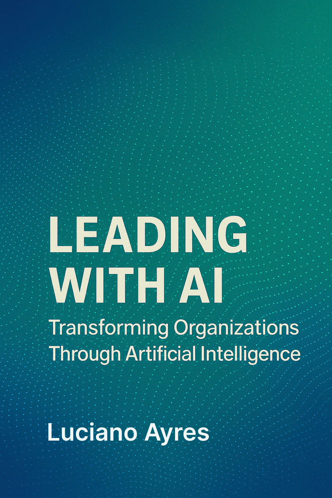

# Leading with AI: Transforming Organizations Through Artificial Intelligence

**[Leading with AI: Transforming Organizations Through Artificial Intelligence](./Leading_with_AI_by_Luciano_Ayres.md)**  
_A Strategic Guide for Business Leaders to Harness AI's Potential_

By **[Luciano Ayres](https://www.linkedin.com/in/lucianoayres/)**

**First Edition | Published May 12, 2025**  
**Version 1.0**

---

## About the Book 📖

_Leading with AI_ explores how business leaders can effectively integrate artificial intelligence into their organizations to drive transformation and achieve competitive advantage.

With practical frameworks and actionable insights, this book equips CEOs, CTOs, and business leaders with the strategies, processes, and governance needed to:

- Understand AI's transformative potential for businesses
- Select and implement the right AI technologies for your organization
- Foster a culture that embraces AI innovation and adoption
- Align AI initiatives with business strategy and operational goals
- Measure impact and calculate real ROI on AI investments

Whether you're just beginning your AI journey or looking to scale existing initiatives, this guide helps you turn AI potential into tangible business outcomes.

---

## How to Read the Book 📚

- **Markdown** (full source):  
  [Read the Book (Markdown)](./Leading_with_AI_by_Luciano_Ayres.md)

- **PDF** (print-ready):  
  [Download PDF](./pdf/Leading_with_AI_by_Luciano_Ayres.pdf)

- **Epub** (e-reader):  
  [Download Epub](./epub/Leading_with_AI_by_Luciano_Ayres.epub)

---

## Table of Contents 📝

- [Introduction](./Leading_with_AI_by_Luciano_Ayres.md#introduction)  
  The AI revolution and its impact on organizations.

- [Chapter 1: Establishing a Clear AI Strategy and Leadership](./Leading_with_AI_by_Luciano_Ayres.md#chapter-1-establishing-a-clear-ai-strategy-and-leadership)  
  Aligning AI with business goals and securing executive support.

- [Chapter 2: Assessing AI Readiness - Laying the Foundations](./Leading_with_AI_by_Luciano_Ayres.md#chapter-2-assessing-ai-readiness---laying-the-foundations)  
  Evaluating data, infrastructure, and organizational capabilities.

- [Chapter 3: Identifying and Prioritizing High-Impact AI Use Cases](./Leading_with_AI_by_Luciano_Ayres.md#chapter-3-identifying-and-prioritizing-high-impact-ai-use-cases)  
  Selecting AI projects with maximum business value.

- [Chapter 4: Running Effective AI Pilot Projects](./Leading_with_AI_by_Luciano_Ayres.md#chapter-4-running-effective-ai-pilot-projects)  
  Designing and implementing successful AI pilots.

- [Chapter 5: Evaluating Pilot Results and Iterating for Improvement](./Leading_with_AI_by_Luciano_Ayres.md#chapter-5-evaluating-pilot-results-and-iterating-for-improvement)  
  Assessing outcomes and making data-driven decisions.

- [Chapter 6: Scaling AI Solutions Across the Enterprise](./Leading_with_AI_by_Luciano_Ayres.md#chapter-6-scaling-ai-solutions-across-the-enterprise)  
  Expanding successful pilots enterprise-wide.

- [Chapter 7: Building and Sustaining the AI Infrastructure](./Leading_with_AI_by_Luciano_Ayres.md#chapter-7-building-and-sustaining-the-ai-infrastructure)  
  Establishing technical architecture and MLOps practices.

- [Chapter 8: Organizing Teams and Talent for AI Success](./Leading_with_AI_by_Luciano_Ayres.md#chapter-8-organizing-teams-and-talent-for-ai-success)  
  Building expertise through hiring and organizational structures.

- [Chapter 9: Governance, Risk, and Ethics in AI Adoption](./Leading_with_AI_by_Luciano_Ayres.md#chapter-9-governance-risk-and-ethics-in-ai-adoption)  
  Frameworks for responsible AI use and compliance.

- [Chapter 10: Measuring ROI and Sustaining the AI-Fueled Organization](./Leading_with_AI_by_Luciano_Ayres.md#chapter-10-measuring-roi-and-sustaining-the-ai-fueled-organization)  
  Tracking success metrics and demonstrating business impact.

- [Conclusion: From Pilots to an AI-Fueled Future](./Leading_with_AI_by_Luciano_Ayres.md#conclusion-from-pilots-to-an-ai-fueled-future)  
  Reflections on the AI transformation journey.

- [References](./Leading_with_AI_by_Luciano_Ayres.md#references)  
  Curated resources cited throughout the book.

---

## Contributing & Feedback 🤝

Your insights and additions make this work stronger. If you have suggestions, corrections, or wish to contribute case studies, please:

1. Open an issue in this repository.
2. Submit a pull request with your changes.

Contributions that enrich examples, refine frameworks, or share new AI adoption experiences are highly welcome.

---

## License 📄

This work is licensed under the [Creative Commons Attribution-ShareAlike 4.0 International License](https://creativecommons.org/licenses/by-sa/4.0/).
